```mermaid
sequenceDiagram
    participant User as 用户
    participant App as iOS应用
    participant DB as 数据库
    participant Local as 本地存储

    User->>App: 点击签到按钮
    App->>App: 验证姓名和邮箱已填写
    
    alt 信息未填写
        App-->>User: 提示填写完整信息
    else 信息已填写
        App->>DB: 查询今日是否已签到
        
        alt 今日已签到
            DB-->>App: 返回已签到记录
            App-->>User: 显示"今日已签到"
        else 今日未签到
            DB-->>App: 无今日记录
            App->>DB: 插入签到记录
            DB-->>App: 插入成功
            App->>Local: 更新last_check_in_date
            App->>App: 播放签到成功动画
            App-->>User: 显示"签到成功"
        end
    end
```

# 一键打卡 APP 设计文档

## 项目概述

### 项目名称
一键打卡（SileMe Check-in App）
<p float="left">
  
  
  
</p>
### 项目目标
开发一款简洁的iOS签到应用，帮助用户通过每日签到保持活跃状态。当用户连续2天未签到时，系统将通知其紧急联系人，以此建立一种关怀机制。

### 技术栈选型
- **前端平台**: iOS（SwiftUI）
- **后端服务**: Supabase BaaS
  - 数据库: PostgreSQL
  - 认证: Supabase Auth（匿名认证）
  - Edge Functions: 用于定时任务和邮件发送
- **开发语言**: Swift
- **UI框架**: SwiftUI（简化开发，组件复用性强）

## 功能需求

### 核心功能列表

1. **用户信息管理**
   - 姓名输入和修改
   - 紧急联系人邮箱输入和修改
   - 信息本地缓存和云端同步

2. **每日签到**
   - 一键签到操作
   - 签到状态实时反馈
   - 签到历史记录

3. **未签到监控**
   - 连续未签到天数统计
   - 达到2天未签到时触发通知机制

4. **紧急联系人通知**
   - 第3天固定时间发送邮件提醒
   - 邮件内容包含用户姓名和未签到天数

5. **用户协议展示**
   - 隐私政策链接
   - 用户协议链接
   - 协议同意确认

## 用户界面设计

### 主界面结构

```
┌─────────────────────────────┐
│         状态栏              │
├─────────────────────────────┤
│                             │
│    你的姓名 [输入框]        │
│                             │
│  紧急联系人邮箱 [输入框]    │
│                             │
│         ┌───────┐           │
│         │       │           │
│         │  👻   │           │
│         │今日签到│           │
│         │       │           │
│         └───────┘           │
│      [签到按钮]             │
│                             │
│  ⓘ 2日未签到，系统将以你的  │
│    名义，在次日邮件通知你的 │
│    紧急联系人               │
│                             │
│  签到即同意 [用户协议] 和   │
│  [隐私政策]                 │
│                             │
└─────────────────────────────┘
```

### 界面状态

| 状态 | 描述 | 签到按钮显示 | 提示信息 |
|------|------|-------------|---------|
| 未签到 | 当天未签到 | "今日签到" | 显示未签到规则说明 |
| 已签到 | 当天已签到 | "签到成功" | 显示签到成功提示 |
| 信息未填 | 姓名或邮箱为空 | 禁用状态 | 提示填写完整信息 |

### 交互流程


## 数据模型设计

### Supabase 数据表结构

#### 表1: users（用户信息表）

| 字段名 | 数据类型 | 约束 | 说明 |
|--------|---------|------|------|
| id | UUID | PRIMARY KEY | 用户唯一标识，由Supabase Auth自动生成 |
| name | VARCHAR(100) | NOT NULL | 用户姓名 |
| emergency_email | VARCHAR(255) | NOT NULL | 紧急联系人邮箱 |
| created_at | TIMESTAMP | DEFAULT NOW() | 创建时间 |
| updated_at | TIMESTAMP | DEFAULT NOW() | 更新时间 |

#### 表2: check_ins（签到记录表）

| 字段名 | 数据类型 | 约束 | 说明 |
|--------|---------|------|------|
| id | BIGSERIAL | PRIMARY KEY | 签到记录ID |
| user_id | UUID | FOREIGN KEY, NOT NULL | 关联用户ID |
| check_in_date | DATE | NOT NULL | 签到日期 |
| check_in_time | TIMESTAMP | DEFAULT NOW() | 签到时间 |
| created_at | TIMESTAMP | DEFAULT NOW() | 记录创建时间 |

**唯一约束**: (user_id, check_in_date) - 确保每个用户每天只能签到一次

#### 表3: notification_logs（通知日志表）

| 字段名 | 数据类型 | 约束 | 说明 |
|--------|---------|------|------|
| id | BIGSERIAL | PRIMARY KEY | 日志ID |
| user_id | UUID | FOREIGN KEY, NOT NULL | 关联用户ID |
| notification_date | DATE | NOT NULL | 通知触发日期 |
| email_sent | BOOLEAN | DEFAULT FALSE | 邮件是否发送成功 |
| consecutive_miss_days | INTEGER | NOT NULL | 连续未签到天数 |
| created_at | TIMESTAMP | DEFAULT NOW() | 记录创建时间 |

### 本地存储数据

| 键名 | 数据类型 | 说明 |
|------|---------|------|
| user_id | String | Supabase匿名用户ID |
| user_name | String | 用户姓名（缓存） |
| emergency_email | String | 紧急联系人邮箱（缓存） |
| last_check_in_date | Date | 最后签到日期 |
| session_token | String | Supabase会话令牌 |

## 系统架构设计

### 整体架构图


### 模块职责划分

#### 前端模块

| 模块名称 | 职责描述 |
|---------|---------|
| 视图层（Views） | 渲染UI界面，处理用户交互事件 |
| 视图模型层（ViewModels） | 管理界面状态，调用数据服务 |
| 数据服务层（Services） | 封装Supabase API调用，管理网络请求 |
| 本地存储层（Storage） | 管理UserDefaults数据持久化 |
| 工具层（Utilities） | 日期处理、验证逻辑等辅助功能 |

#### 后端模块

| 模块名称 | 职责描述 |
|---------|---------|
| 认证服务 | 管理匿名用户身份识别和会话 |
| 数据库 | 存储用户信息、签到记录和通知日志 |
| 定时检测函数 | 每日固定时间执行未签到检测 |
| 邮件发送函数 | 向紧急联系人发送通知邮件 |

## 业务流程设计

### 用户注册与身份识别流程


### 签到流程



### 未签到检测与通知流程


## 核心业务逻辑

### 签到规则

| 规则项 | 说明 |
|-------|------|
| 签到频率 | 每天只能签到一次 |
| 签到时间窗口 | 全天24小时任何时间均可签到 |
| 日期判断 | 基于用户设备本地时区的日期（YYYY-MM-DD） |
| 重复签到 | 同一天重复点击签到按钮，仅保留第一次记录 |

### 连续未签到计算逻辑

计算逻辑描述：
- 从当前日期（不含今日）向前查找最近的签到记录
- 计算最近签到日期与当前日期之间的自然日差值
- 差值减1即为连续未签到天数

示例场景：

| 最后签到日期 | 当前日期 | 连续未签到天数 | 是否触发通知 |
|------------|---------|--------------|------------|
| 2026-01-10 | 2026-01-11 | 0 | 否 |
| 2026-01-10 | 2026-01-12 | 1 | 否 |
| 2026-01-10 | 2026-01-13 | 2 | 是（第3天发送） |
| 2026-01-10 | 2026-01-14 | 3 | 否（已发送过） |

### 通知触发规则

| 触发条件 | 执行动作 | 防重复机制 |
|---------|---------|-----------|
| 连续2天未签到 | 在第3天的固定时间发送邮件 | 检查notification_logs表，同一日期同一用户仅发送一次 |
| 发送时间 | 建议每天上午9:00（UTC+8） | 通过Supabase Edge Function的Cron Job配置 |
| 邮件内容 | 包含用户姓名、连续未签到天数、应用名称 | 使用邮件模板 |

### 邮件模板

邮件主题格式：
```
[一键打卡] 关于 {用户姓名} 的签到提醒
```

邮件正文格式：
```
您好，

您是 {用户姓名} 设置的紧急联系人。

{用户姓名} 已连续 2 天未在"一键打卡"应用中签到。

这是一封自动提醒邮件，请您在方便时确认 TA 的状态。

此致
一键打卡团队
```

## 数据验证规则

### 前端验证

| 字段 | 验证规则 | 错误提示 |
|------|---------|---------|
| 姓名 | 非空，长度1-50字符 | "请输入您的姓名（1-50字符）" |
| 紧急联系人邮箱 | 非空，符合邮箱格式 | "请输入有效的邮箱地址" |

### 后端验证

| 验证项 | 验证逻辑 | 处理方式 |
|-------|---------|---------|
| 用户身份 | 验证Supabase session有效性 | 无效则返回401错误 |
| 签到日期 | 检查是否为当前日期 | 非当前日期拒绝签到 |
| 数据完整性 | 检查必填字段是否存在 | 缺失则返回400错误 |

## 状态管理

### 应用状态定义

| 状态名称 | 数据类型 | 说明 |
|---------|---------|------|
| isAuthenticated | Boolean | 用户是否已认证 |
| userName | String? | 用户姓名 |
| emergencyEmail | String? | 紧急联系人邮箱 |
| hasCheckedInToday | Boolean | 今日是否已签到 |
| isLoading | Boolean | 是否正在加载 |
| errorMessage | String? | 错误信息 |

### 状态流转图


## 错误处理策略

### 错误分类

| 错误类型 | 场景示例 | 处理策略 |
|---------|---------|---------|
| 网络错误 | 无网络连接、请求超时 | 显示友好提示，提供重试按钮 |
| 认证错误 | Session过期、认证失败 | 自动重新认证，失败则提示用户 |
| 数据验证错误 | 邮箱格式错误、姓名为空 | 在输入框下方显示红色错误提示 |
| 服务器错误 | 500错误、数据库异常 | 显示通用错误提示，记录日志 |

### 错误提示文案

| 错误场景 | 提示文案 |
|---------|---------|
| 网络不可用 | "网络连接失败，请检查网络后重试" |
| 签到失败 | "签到失败，请稍后重试" |
| 邮箱格式错误 | "请输入有效的邮箱地址" |
| 姓名为空 | "请输入您的姓名" |
| 服务器异常 | "服务暂时不可用，请稍后重试" |

## Supabase 配置说明

### 数据库配置

#### Row Level Security (RLS) 策略

**users 表策略**：
- 用户仅可读写自己的记录（user_id = auth.uid()）
- 插入时自动设置user_id为当前认证用户ID

**check_ins 表策略**：
- 用户仅可插入和查询自己的签到记录
- 禁止更新和删除操作

**notification_logs 表策略**：
- 仅系统Edge Function有写入权限
- 用户无读写权限

### Edge Functions 配置

#### 函数1: check-missed-check-ins（检测未签到）

**触发方式**: Cron Job  
**执行频率**: 每天上午9:00（UTC+8）  
**Cron表达式**: `0 1 * * *`（UTC时间凌晨1点 = UTC+8上午9点）

**函数职责**：
- 查询所有用户的最后签到记录
- 计算连续未签到天数
- 识别连续2天未签到的用户
- 调用邮件发送函数

#### 函数2: send-notification-email（发送通知邮件）

**触发方式**: 被check-missed-check-ins函数调用  
**执行条件**: 用户连续2天未签到且当日未发送过通知

**函数职责**：
- 接收用户信息和未签到天数
- 构建邮件内容
- 调用SMTP服务发送邮件
- 记录发送结果到notification_logs表

### 环境变量配置

| 变量名 | 说明 | 示例值 |
|-------|------|-------|
| SMTP_HOST | SMTP服务器地址 | smtp.example.com |
| SMTP_PORT | SMTP端口 | 587 |
| SMTP_USER | SMTP用户名 | noreply@example.com |
| SMTP_PASSWORD | SMTP密码 | ******** |
| FROM_EMAIL | 发件人邮箱 | noreply@sileme.app |
| FROM_NAME | 发件人名称 | 一键打卡团队 |

## 安全性设计

### 认证安全

| 安全措施 | 实现方式 |
|---------|---------|
| 匿名认证 | 使用Supabase匿名认证，每个设备生成唯一UUID |
| Session管理 | 本地安全存储session token，定期验证有效性 |
| API鉴权 | 所有API请求携带有效session token |

### 数据安全

| 安全措施 | 实现方式 |
|---------|---------|
| 数据隔离 | 通过RLS策略确保用户只能访问自己的数据 |
| 邮箱保护 | 紧急联系人邮箱仅用于发送通知，不对外暴露 |
| 传输加密 | 所有网络请求使用HTTPS/TLS加密 |

### 隐私保护

| 隐私措施 | 实施说明 |
|---------|---------|
| 最小化数据收集 | 仅收集必要的姓名和紧急联系人邮箱 |
| 匿名化 | 不收集真实手机号、身份证等敏感信息 |
| 数据删除 | 用户可通过清除应用数据删除本地信息 |

## 性能优化策略

### 前端优化

| 优化项 | 实现方案 |
|-------|---------|
| 本地缓存 | 用户信息和签到状态缓存到本地，减少网络请求 |
| 懒加载 | 历史记录按需加载，避免一次性加载过多数据 |
| 防抖处理 | 签到按钮点击后禁用，防止重复提交 |

### 后端优化

| 优化项 | 实现方案 |
|-------|---------|
| 数据库索引 | 在user_id、check_in_date字段建立索引 |
| 批量处理 | 检测函数批量查询用户，减少数据库连接次数 |
| 异步发送 | 邮件发送采用异步方式，不阻塞主流程 |

## 部署与运维

### iOS应用发布

| 发布阶段 | 检查项 |
|---------|-------|
| 开发测试 | 使用Supabase测试项目，验证所有功能 |
| TestFlight | 邀请小范围用户测试，收集反馈 |
| App Store审核 | 准备隐私政策和用户协议文档链接 |
| 正式发布 | 切换到Supabase生产项目 |

### Supabase配置部署

| 配置项 | 部署步骤 |
|-------|---------|
| 数据库表 | 通过Supabase Dashboard执行SQL创建表结构 |
| RLS策略 | 为每张表配置Row Level Security策略 |
| Edge Functions | 部署两个Edge Functions并配置环境变量 |
| Cron Job | 在Supabase Dashboard配置定时任务 |

### 监控与日志

| 监控项 | 监控方式 |
|-------|---------|
| 签到成功率 | 统计每日签到请求成功/失败次数 |
| 邮件发送状态 | 记录邮件发送成功/失败日志 |
| 错误日志 | Edge Functions记录异常信息到日志表 |
| 用户增长 | 统计每日新增用户数 |

## 后续扩展方向

### 功能扩展建议

| 扩展方向 | 说明 | 优先级 |
|---------|------|-------|
| 签到统计 | 展示签到天数、连续签到记录等 | 高 |
| 多紧急联系人 | 支持添加多个紧急联系人 | 中 |
| 自定义通知时间 | 允许用户设置通知发送时间 | 中 |
| 签到提醒 | 本地推送通知提醒用户签到 | 高 |
| 数据导出 | 支持导出签到历史记录 | 低 |

### 技术优化方向

| 优化方向 | 说明 | 优先级 |
|---------|------|-------|
| 离线支持 | 离线状态下允许签到，联网后同步 | 中 |
| 数据备份 | 定期备份用户数据到云端 | 高 |
| 多设备同步 | 支持同一账号多设备数据同步 | 低 |
| 性能监控 | 接入APM工具监控应用性能 | 中 |

## 依赖项说明

### iOS应用依赖

| 依赖库 | 用途 | 安装方式 |
|-------|------|---------|
| supabase-swift | Supabase客户端SDK | Swift Package Manager |

**注意**: 本项目仅依赖官方Supabase SDK，所有UI组件使用SwiftUI原生组件，无需额外UI库。

### Supabase Edge Functions依赖

| 依赖模块 | 用途 | 引入方式 |
|---------|------|---------|
| @supabase/supabase-js | Supabase客户端 | npm/deno |
| nodemailer / SMTP库 | 邮件发送 | npm/deno |

**注意**: 根据用户要求，任何新增依赖需提前告知并获得确认。

## 用户协议与隐私政策

### 协议链接配置

| 协议类型 | URL配置位置 | 说明 |
|---------|-----------|------|
| 用户协议 | 应用内配置常量 | 点击跳转到Safari浏览器打开 |
| 隐私政策 | 应用内配置常量 | 点击跳转到Safari浏览器打开 |

### 协议展示规则

- 协议链接显示在主界面底部
- 首次签到视为同意协议
- 链接文本可点击，使用系统默认蓝色
- 点击后使用SFSafariViewController打开网页

## 技术实现要点

### SwiftUI组件复用

| 组件类型 | 复用方式 |
|---------|---------|
| 输入框 | 封装自定义TextField组件，统一样式 |
| 按钮 | 封装签到按钮组件，支持多种状态 |
| 提示信息 | 封装InfoBox组件，支持图标和文字 |
| 加载动画 | 使用系统ProgressView |

### 日期处理

| 处理场景 | 实现方式 |
|---------|---------|
| 获取当前日期 | 使用Calendar.current获取本地时区日期 |
| 日期比较 | Calendar组件的date comparison方法 |
| 日期格式化 | DateFormatter配置为"yyyy-MM-dd"格式 |

### 异步处理

| 异步场景 | 实现方式 |
|---------|---------|
| 网络请求 | 使用async/await语法调用Supabase SDK |
| UI更新 | 使用@MainActor确保主线程更新 |
| 错误处理 | try-catch捕获异步错误 |

## 开发阶段划分

### 阶段1: 基础框架搭建
- Supabase项目创建和配置
- 数据库表结构创建
- iOS项目初始化
- Supabase SDK集成

### 阶段2: 核心功能开发
- 用户认证流程
- 用户信息输入和保存
- 签到功能实现
- 本地状态管理

### 阶段3: 后端服务开发
- Edge Function: 检测未签到
- Edge Function: 发送邮件
- Cron Job配置
- RLS策略配置

### 阶段4: UI优化与测试
- 界面美化和动画
- 错误处理完善
- 集成测试
- 用户体验优化

### 阶段5: 发布准备
- 准备隐私政策和用户协议
- App Store素材准备
- TestFlight测试
- 正式发布

## 风险评估与应对

### 技术风险

| 风险项 | 影响 | 应对措施 |
|-------|------|---------|
| Supabase服务不稳定 | 签到功能不可用 | 实现离线签到队列，联网后重试 |
| 邮件发送失败 | 紧急联系人未收到通知 | 记录失败日志，次日重试机制 |
| 匿名认证丢失 | 用户数据丢失 | 提示用户备份user_id，支持恢复 |

### 业务风险

| 风险项 | 影响 | 应对措施 |
|-------|------|---------|
| 用户误填邮箱 | 通知发送到错误邮箱 | 提供邮箱修改功能，发送前验证邮箱格式 |
| 邮件被标记为垃圾邮件 | 紧急联系人未看到通知 | 使用正规SMTP服务，优化邮件内容 |
| 时区处理错误 | 签到日期判断错误 | 统一使用用户设备本地时区 |

### 合规风险

| 风险项 | 影响 | 应对措施 |
|-------|------|---------|
| 隐私政策不完善 | App Store审核被拒 | 聘请法律顾问审核隐私政策 |
| 未经同意发送邮件 | 违反反垃圾邮件法 | 明确告知用户邮件通知机制 |
| 数据存储不合规 | 法律风险 | 确保Supabase服务符合当地法规 |
## 项目概述

### 项目名称
一键打卡（SileMe Check-in App）

### 项目目标
开发一款简洁的iOS签到应用，帮助用户通过每日签到保持活跃状态。当用户连续2天未签到时，系统将通知其紧急联系人，以此建立一种关怀机制。

### 技术栈选型
- **前端平台**: iOS（SwiftUI）
- **后端服务**: Supabase BaaS
  - 数据库: PostgreSQL
  - 认证: Supabase Auth（匿名认证）
  - Edge Functions: 用于定时任务和邮件发送
- **开发语言**: Swift
- **UI框架**: SwiftUI（简化开发，组件复用性强）

## 功能需求

### 核心功能列表

1. **用户信息管理**
   - 姓名输入和修改
   - 紧急联系人邮箱输入和修改
   - 信息本地缓存和云端同步

2. **每日签到**
   - 一键签到操作
   - 签到状态实时反馈
   - 签到历史记录

3. **未签到监控**
   - 连续未签到天数统计
   - 达到2天未签到时触发通知机制

4. **紧急联系人通知**
   - 第3天固定时间发送邮件提醒
   - 邮件内容包含用户姓名和未签到天数

5. **用户协议展示**
   - 隐私政策链接
   - 用户协议链接
   - 协议同意确认

## 用户界面设计

### 主界面结构

```
┌─────────────────────────────┐
│         状态栏              │
├─────────────────────────────┤
│                             │
│    你的姓名 [输入框]        │
│                             │
│  紧急联系人邮箱 [输入框]    │
│                             │
│         ┌───────┐           │
│         │       │           │
│         │  👻   │           │
│         │今日签到│           │
│         │       │           │
│         └───────┘           │
│      [签到按钮]             │
│                             │
│  ⓘ 2日未签到，系统将以你的  │
│    名义，在次日邮件通知你的 │
│    紧急联系人               │
│                             │
│  签到即同意 [用户协议] 和   │
│  [隐私政策]                 │
│                             │
└─────────────────────────────┘
```

### 界面状态

| 状态 | 描述 | 签到按钮显示 | 提示信息 |
|------|------|-------------|---------|
| 未签到 | 当天未签到 | "今日签到" | 显示未签到规则说明 |
| 已签到 | 当天已签到 | "签到成功" | 显示签到成功提示 |
| 信息未填 | 姓名或邮箱为空 | 禁用状态 | 提示填写完整信息 |

### 交互流程


## 数据模型设计

### Supabase 数据表结构

#### 表1: users（用户信息表）

| 字段名 | 数据类型 | 约束 | 说明 |
|--------|---------|------|------|
| id | UUID | PRIMARY KEY | 用户唯一标识，由Supabase Auth自动生成 |
| name | VARCHAR(100) | NOT NULL | 用户姓名 |
| emergency_email | VARCHAR(255) | NOT NULL | 紧急联系人邮箱 |
| created_at | TIMESTAMP | DEFAULT NOW() | 创建时间 |
| updated_at | TIMESTAMP | DEFAULT NOW() | 更新时间 |

#### 表2: check_ins（签到记录表）

| 字段名 | 数据类型 | 约束 | 说明 |
|--------|---------|------|------|
| id | BIGSERIAL | PRIMARY KEY | 签到记录ID |
| user_id | UUID | FOREIGN KEY, NOT NULL | 关联用户ID |
| check_in_date | DATE | NOT NULL | 签到日期 |
| check_in_time | TIMESTAMP | DEFAULT NOW() | 签到时间 |
| created_at | TIMESTAMP | DEFAULT NOW() | 记录创建时间 |

**唯一约束**: (user_id, check_in_date) - 确保每个用户每天只能签到一次

#### 表3: notification_logs（通知日志表）

| 字段名 | 数据类型 | 约束 | 说明 |
|--------|---------|------|------|
| id | BIGSERIAL | PRIMARY KEY | 日志ID |
| user_id | UUID | FOREIGN KEY, NOT NULL | 关联用户ID |
| notification_date | DATE | NOT NULL | 通知触发日期 |
| email_sent | BOOLEAN | DEFAULT FALSE | 邮件是否发送成功 |
| consecutive_miss_days | INTEGER | NOT NULL | 连续未签到天数 |
| created_at | TIMESTAMP | DEFAULT NOW() | 记录创建时间 |

### 本地存储数据

| 键名 | 数据类型 | 说明 |
|------|---------|------|
| user_id | String | Supabase匿名用户ID |
| user_name | String | 用户姓名（缓存） |
| emergency_email | String | 紧急联系人邮箱（缓存） |
| last_check_in_date | Date | 最后签到日期 |
| session_token | String | Supabase会话令牌 |

## 系统架构设计

### 整体架构图


### 模块职责划分

#### 前端模块

| 模块名称 | 职责描述 |
|---------|---------|
| 视图层（Views） | 渲染UI界面，处理用户交互事件 |
| 视图模型层（ViewModels） | 管理界面状态，调用数据服务 |
| 数据服务层（Services） | 封装Supabase API调用，管理网络请求 |
| 本地存储层（Storage） | 管理UserDefaults数据持久化 |
| 工具层（Utilities） | 日期处理、验证逻辑等辅助功能 |

#### 后端模块

| 模块名称 | 职责描述 |
|---------|---------|
| 认证服务 | 管理匿名用户身份识别和会话 |
| 数据库 | 存储用户信息、签到记录和通知日志 |
| 定时检测函数 | 每日固定时间执行未签到检测 |
| 邮件发送函数 | 向紧急联系人发送通知邮件 |

## 业务流程设计

### 用户注册与身份识别流程


### 签到流程


### 未签到检测与通知流程


## 核心业务逻辑

### 签到规则

| 规则项 | 说明 |
|-------|------|
| 签到频率 | 每天只能签到一次 |
| 签到时间窗口 | 全天24小时任何时间均可签到 |
| 日期判断 | 基于用户设备本地时区的日期（YYYY-MM-DD） |
| 重复签到 | 同一天重复点击签到按钮，仅保留第一次记录 |

### 连续未签到计算逻辑

计算逻辑描述：
- 从当前日期（不含今日）向前查找最近的签到记录
- 计算最近签到日期与当前日期之间的自然日差值
- 差值减1即为连续未签到天数

示例场景：

| 最后签到日期 | 当前日期 | 连续未签到天数 | 是否触发通知 |
|------------|---------|--------------|------------|
| 2026-01-10 | 2026-01-11 | 0 | 否 |
| 2026-01-10 | 2026-01-12 | 1 | 否 |
| 2026-01-10 | 2026-01-13 | 2 | 是（第3天发送） |
| 2026-01-10 | 2026-01-14 | 3 | 否（已发送过） |

### 通知触发规则

| 触发条件 | 执行动作 | 防重复机制 |
|---------|---------|-----------|
| 连续2天未签到 | 在第3天的固定时间发送邮件 | 检查notification_logs表，同一日期同一用户仅发送一次 |
| 发送时间 | 建议每天上午9:00（UTC+8） | 通过Supabase Edge Function的Cron Job配置 |
| 邮件内容 | 包含用户姓名、连续未签到天数、应用名称 | 使用邮件模板 |

### 邮件模板

邮件主题格式：
```
[一键打卡] 关于 {用户姓名} 的签到提醒
```

邮件正文格式：
```
您好，

您是 {用户姓名} 设置的紧急联系人。

{用户姓名} 已连续 2 天未在"一键打卡"应用中签到。

这是一封自动提醒邮件，请您在方便时确认 TA 的状态。

此致
一键打卡团队
```

## 数据验证规则

### 前端验证

| 字段 | 验证规则 | 错误提示 |
|------|---------|---------|
| 姓名 | 非空，长度1-50字符 | "请输入您的姓名（1-50字符）" |
| 紧急联系人邮箱 | 非空，符合邮箱格式 | "请输入有效的邮箱地址" |

### 后端验证

| 验证项 | 验证逻辑 | 处理方式 |
|-------|---------|---------|
| 用户身份 | 验证Supabase session有效性 | 无效则返回401错误 |
| 签到日期 | 检查是否为当前日期 | 非当前日期拒绝签到 |
| 数据完整性 | 检查必填字段是否存在 | 缺失则返回400错误 |

## 状态管理

### 应用状态定义

| 状态名称 | 数据类型 | 说明 |
|---------|---------|------|
| isAuthenticated | Boolean | 用户是否已认证 |
| userName | String? | 用户姓名 |
| emergencyEmail | String? | 紧急联系人邮箱 |
| hasCheckedInToday | Boolean | 今日是否已签到 |
| isLoading | Boolean | 是否正在加载 |
| errorMessage | String? | 错误信息 |

### 状态流转图


## 错误处理策略

### 错误分类

| 错误类型 | 场景示例 | 处理策略 |
|---------|---------|---------|
| 网络错误 | 无网络连接、请求超时 | 显示友好提示，提供重试按钮 |
| 认证错误 | Session过期、认证失败 | 自动重新认证，失败则提示用户 |
| 数据验证错误 | 邮箱格式错误、姓名为空 | 在输入框下方显示红色错误提示 |
| 服务器错误 | 500错误、数据库异常 | 显示通用错误提示，记录日志 |

### 错误提示文案

| 错误场景 | 提示文案 |
|---------|---------|
| 网络不可用 | "网络连接失败，请检查网络后重试" |
| 签到失败 | "签到失败，请稍后重试" |
| 邮箱格式错误 | "请输入有效的邮箱地址" |
| 姓名为空 | "请输入您的姓名" |
| 服务器异常 | "服务暂时不可用，请稍后重试" |

## Supabase 配置说明

### 数据库配置

#### Row Level Security (RLS) 策略

**users 表策略**：
- 用户仅可读写自己的记录（user_id = auth.uid()）
- 插入时自动设置user_id为当前认证用户ID

**check_ins 表策略**：
- 用户仅可插入和查询自己的签到记录
- 禁止更新和删除操作

**notification_logs 表策略**：
- 仅系统Edge Function有写入权限
- 用户无读写权限

### Edge Functions 配置

#### 函数1: check-missed-check-ins（检测未签到）

**触发方式**: Cron Job  
**执行频率**: 每天上午9:00（UTC+8）  
**Cron表达式**: `0 1 * * *`（UTC时间凌晨1点 = UTC+8上午9点）

**函数职责**：
- 查询所有用户的最后签到记录
- 计算连续未签到天数
- 识别连续2天未签到的用户
- 调用邮件发送函数

#### 函数2: send-notification-email（发送通知邮件）

**触发方式**: 被check-missed-check-ins函数调用  
**执行条件**: 用户连续2天未签到且当日未发送过通知

**函数职责**：
- 接收用户信息和未签到天数
- 构建邮件内容
- 调用SMTP服务发送邮件
- 记录发送结果到notification_logs表

### 环境变量配置

| 变量名 | 说明 | 示例值 |
|-------|------|-------|
| SMTP_HOST | SMTP服务器地址 | smtp.example.com |
| SMTP_PORT | SMTP端口 | 587 |
| SMTP_USER | SMTP用户名 | noreply@example.com |
| SMTP_PASSWORD | SMTP密码 | ******** |
| FROM_EMAIL | 发件人邮箱 | noreply@sileme.app |
| FROM_NAME | 发件人名称 | 一键打卡团队 |

## 安全性设计

### 认证安全

| 安全措施 | 实现方式 |
|---------|---------|
| 匿名认证 | 使用Supabase匿名认证，每个设备生成唯一UUID |
| Session管理 | 本地安全存储session token，定期验证有效性 |
| API鉴权 | 所有API请求携带有效session token |

### 数据安全

| 安全措施 | 实现方式 |
|---------|---------|
| 数据隔离 | 通过RLS策略确保用户只能访问自己的数据 |
| 邮箱保护 | 紧急联系人邮箱仅用于发送通知，不对外暴露 |
| 传输加密 | 所有网络请求使用HTTPS/TLS加密 |

### 隐私保护

| 隐私措施 | 实施说明 |
|---------|---------|
| 最小化数据收集 | 仅收集必要的姓名和紧急联系人邮箱 |
| 匿名化 | 不收集真实手机号、身份证等敏感信息 |
| 数据删除 | 用户可通过清除应用数据删除本地信息 |

## 性能优化策略

### 前端优化

| 优化项 | 实现方案 |
|-------|---------|
| 本地缓存 | 用户信息和签到状态缓存到本地，减少网络请求 |
| 懒加载 | 历史记录按需加载，避免一次性加载过多数据 |
| 防抖处理 | 签到按钮点击后禁用，防止重复提交 |

### 后端优化

| 优化项 | 实现方案 |
|-------|---------|
| 数据库索引 | 在user_id、check_in_date字段建立索引 |
| 批量处理 | 检测函数批量查询用户，减少数据库连接次数 |
| 异步发送 | 邮件发送采用异步方式，不阻塞主流程 |

## 部署与运维

### iOS应用发布

| 发布阶段 | 检查项 |
|---------|-------|
| 开发测试 | 使用Supabase测试项目，验证所有功能 |
| TestFlight | 邀请小范围用户测试，收集反馈 |
| App Store审核 | 准备隐私政策和用户协议文档链接 |
| 正式发布 | 切换到Supabase生产项目 |

### Supabase配置部署

| 配置项 | 部署步骤 |
|-------|---------|
| 数据库表 | 通过Supabase Dashboard执行SQL创建表结构 |
| RLS策略 | 为每张表配置Row Level Security策略 |
| Edge Functions | 部署两个Edge Functions并配置环境变量 |
| Cron Job | 在Supabase Dashboard配置定时任务 |

### 监控与日志

| 监控项 | 监控方式 |
|-------|---------|
| 签到成功率 | 统计每日签到请求成功/失败次数 |
| 邮件发送状态 | 记录邮件发送成功/失败日志 |
| 错误日志 | Edge Functions记录异常信息到日志表 |
| 用户增长 | 统计每日新增用户数 |

## 后续扩展方向

### 功能扩展建议

| 扩展方向 | 说明 | 优先级 |
|---------|------|-------|
| 签到统计 | 展示签到天数、连续签到记录等 | 高 |
| 多紧急联系人 | 支持添加多个紧急联系人 | 中 |
| 自定义通知时间 | 允许用户设置通知发送时间 | 中 |
| 签到提醒 | 本地推送通知提醒用户签到 | 高 |
| 数据导出 | 支持导出签到历史记录 | 低 |

### 技术优化方向

| 优化方向 | 说明 | 优先级 |
|---------|------|-------|
| 离线支持 | 离线状态下允许签到，联网后同步 | 中 |
| 数据备份 | 定期备份用户数据到云端 | 高 |
| 多设备同步 | 支持同一账号多设备数据同步 | 低 |
| 性能监控 | 接入APM工具监控应用性能 | 中 |

## 依赖项说明

### iOS应用依赖

| 依赖库 | 用途 | 安装方式 |
|-------|------|---------|
| supabase-swift | Supabase客户端SDK | Swift Package Manager |

**注意**: 本项目仅依赖官方Supabase SDK，所有UI组件使用SwiftUI原生组件，无需额外UI库。

### Supabase Edge Functions依赖

| 依赖模块 | 用途 | 引入方式 |
|---------|------|---------|
| @supabase/supabase-js | Supabase客户端 | npm/deno |
| nodemailer / SMTP库 | 邮件发送 | npm/deno |

**注意**: 根据用户要求，任何新增依赖需提前告知并获得确认。

## 用户协议与隐私政策

### 协议链接配置

| 协议类型 | URL配置位置 | 说明 |
|---------|-----------|------|
| 用户协议 | 应用内配置常量 | 点击跳转到Safari浏览器打开 |
| 隐私政策 | 应用内配置常量 | 点击跳转到Safari浏览器打开 |

### 协议展示规则

- 协议链接显示在主界面底部
- 首次签到视为同意协议
- 链接文本可点击，使用系统默认蓝色
- 点击后使用SFSafariViewController打开网页

## 技术实现要点

### SwiftUI组件复用

| 组件类型 | 复用方式 |
|---------|---------|
| 输入框 | 封装自定义TextField组件，统一样式 |
| 按钮 | 封装签到按钮组件，支持多种状态 |
| 提示信息 | 封装InfoBox组件，支持图标和文字 |
| 加载动画 | 使用系统ProgressView |

### 日期处理

| 处理场景 | 实现方式 |
|---------|---------|
| 获取当前日期 | 使用Calendar.current获取本地时区日期 |
| 日期比较 | Calendar组件的date comparison方法 |
| 日期格式化 | DateFormatter配置为"yyyy-MM-dd"格式 |

### 异步处理

| 异步场景 | 实现方式 |
|---------|---------|
| 网络请求 | 使用async/await语法调用Supabase SDK |
| UI更新 | 使用@MainActor确保主线程更新 |
| 错误处理 | try-catch捕获异步错误 |

## 开发阶段划分

### 阶段1: 基础框架搭建
- Supabase项目创建和配置
- 数据库表结构创建
- iOS项目初始化
- Supabase SDK集成

### 阶段2: 核心功能开发
- 用户认证流程
- 用户信息输入和保存
- 签到功能实现
- 本地状态管理

### 阶段3: 后端服务开发
- Edge Function: 检测未签到
- Edge Function: 发送邮件
- Cron Job配置
- RLS策略配置

### 阶段4: UI优化与测试
- 界面美化和动画
- 错误处理完善
- 集成测试
- 用户体验优化

### 阶段5: 发布准备
- 准备隐私政策和用户协议
- App Store素材准备
- TestFlight测试
- 正式发布

## 风险评估与应对

### 技术风险

| 风险项 | 影响 | 应对措施 |
|-------|------|---------|
| Supabase服务不稳定 | 签到功能不可用 | 实现离线签到队列，联网后重试 |
| 邮件发送失败 | 紧急联系人未收到通知 | 记录失败日志，次日重试机制 |
| 匿名认证丢失 | 用户数据丢失 | 提示用户备份user_id，支持恢复 |

### 业务风险

| 风险项 | 影响 | 应对措施 |
|-------|------|---------|
| 用户误填邮箱 | 通知发送到错误邮箱 | 提供邮箱修改功能，发送前验证邮箱格式 |
| 邮件被标记为垃圾邮件 | 紧急联系人未看到通知 | 使用正规SMTP服务，优化邮件内容 |
| 时区处理错误 | 签到日期判断错误 | 统一使用用户设备本地时区 |

### 合规风险

| 风险项 | 影响 | 应对措施 |
|-------|------|---------|
| 隐私政策不完善 | App Store审核被拒 | 聘请法律顾问审核隐私政策 |
| 未经同意发送邮件 | 违反反垃圾邮件法 | 明确告知用户邮件通知机制 |
| 数据存储不合规 | 法律风险 | 确保Supabase服务符合当地法规 |
## 项目概述

### 项目名称
一键打卡（SileMe Check-in App）

### 项目目标
开发一款简洁的iOS签到应用，帮助用户通过每日签到保持活跃状态。当用户连续2天未签到时，系统将通知其紧急联系人，以此建立一种关怀机制。

### 技术栈选型
- **前端平台**: iOS（SwiftUI）
- **后端服务**: Supabase BaaS
  - 数据库: PostgreSQL
  - 认证: Supabase Auth（匿名认证）
  - Edge Functions: 用于定时任务和邮件发送
- **开发语言**: Swift
- **UI框架**: SwiftUI（简化开发，组件复用性强）

## 功能需求

### 核心功能列表

1. **用户信息管理**
   - 姓名输入和修改
   - 紧急联系人邮箱输入和修改
   - 信息本地缓存和云端同步

2. **每日签到**
   - 一键签到操作
   - 签到状态实时反馈
   - 签到历史记录

3. **未签到监控**
   - 连续未签到天数统计
   - 达到2天未签到时触发通知机制

4. **紧急联系人通知**
   - 第3天固定时间发送邮件提醒
   - 邮件内容包含用户姓名和未签到天数

5. **用户协议展示**
   - 隐私政策链接
   - 用户协议链接
   - 协议同意确认

## 用户界面设计

### 主界面结构

```
┌─────────────────────────────┐
│         状态栏              │
├─────────────────────────────┤
│                             │
│    你的姓名 [输入框]        │
│                             │
│  紧急联系人邮箱 [输入框]    │
│                             │
│         ┌───────┐           │
│         │       │           │
│         │  👻   │           │
│         │今日签到│           │
│         │       │           │
│         └───────┘           │
│      [签到按钮]             │
│                             │
│  ⓘ 2日未签到，系统将以你的  │
│    名义，在次日邮件通知你的 │
│    紧急联系人               │
│                             │
│  签到即同意 [用户协议] 和   │
│  [隐私政策]                 │
│                             │
└─────────────────────────────┘
```

### 界面状态

| 状态 | 描述 | 签到按钮显示 | 提示信息 |
|------|------|-------------|---------|
| 未签到 | 当天未签到 | "今日签到" | 显示未签到规则说明 |
| 已签到 | 当天已签到 | "签到成功" | 显示签到成功提示 |
| 信息未填 | 姓名或邮箱为空 | 禁用状态 | 提示填写完整信息 |

### 交互流程


## 数据模型设计

### Supabase 数据表结构

#### 表1: users（用户信息表）

| 字段名 | 数据类型 | 约束 | 说明 |
|--------|---------|------|------|
| id | UUID | PRIMARY KEY | 用户唯一标识，由Supabase Auth自动生成 |
| name | VARCHAR(100) | NOT NULL | 用户姓名 |
| emergency_email | VARCHAR(255) | NOT NULL | 紧急联系人邮箱 |
| created_at | TIMESTAMP | DEFAULT NOW() | 创建时间 |
| updated_at | TIMESTAMP | DEFAULT NOW() | 更新时间 |

#### 表2: check_ins（签到记录表）

| 字段名 | 数据类型 | 约束 | 说明 |
|--------|---------|------|------|
| id | BIGSERIAL | PRIMARY KEY | 签到记录ID |
| user_id | UUID | FOREIGN KEY, NOT NULL | 关联用户ID |
| check_in_date | DATE | NOT NULL | 签到日期 |
| check_in_time | TIMESTAMP | DEFAULT NOW() | 签到时间 |
| created_at | TIMESTAMP | DEFAULT NOW() | 记录创建时间 |

**唯一约束**: (user_id, check_in_date) - 确保每个用户每天只能签到一次

#### 表3: notification_logs（通知日志表）

| 字段名 | 数据类型 | 约束 | 说明 |
|--------|---------|------|------|
| id | BIGSERIAL | PRIMARY KEY | 日志ID |
| user_id | UUID | FOREIGN KEY, NOT NULL | 关联用户ID |
| notification_date | DATE | NOT NULL | 通知触发日期 |
| email_sent | BOOLEAN | DEFAULT FALSE | 邮件是否发送成功 |
| consecutive_miss_days | INTEGER | NOT NULL | 连续未签到天数 |
| created_at | TIMESTAMP | DEFAULT NOW() | 记录创建时间 |

### 本地存储数据

| 键名 | 数据类型 | 说明 |
|------|---------|------|
| user_id | String | Supabase匿名用户ID |
| user_name | String | 用户姓名（缓存） |
| emergency_email | String | 紧急联系人邮箱（缓存） |
| last_check_in_date | Date | 最后签到日期 |
| session_token | String | Supabase会话令牌 |

## 系统架构设计

### 整体架构图


### 模块职责划分

#### 前端模块

| 模块名称 | 职责描述 |
|---------|---------|
| 视图层（Views） | 渲染UI界面，处理用户交互事件 |
| 视图模型层（ViewModels） | 管理界面状态，调用数据服务 |
| 数据服务层（Services） | 封装Supabase API调用，管理网络请求 |
| 本地存储层（Storage） | 管理UserDefaults数据持久化 |
| 工具层（Utilities） | 日期处理、验证逻辑等辅助功能 |

#### 后端模块

| 模块名称 | 职责描述 |
|---------|---------|
| 认证服务 | 管理匿名用户身份识别和会话 |
| 数据库 | 存储用户信息、签到记录和通知日志 |
| 定时检测函数 | 每日固定时间执行未签到检测 |
| 邮件发送函数 | 向紧急联系人发送通知邮件 |

## 业务流程设计

### 用户注册与身份识别流程


### 签到流程


### 未签到检测与通知流程


## 核心业务逻辑

### 签到规则

| 规则项 | 说明 |
|-------|------|
| 签到频率 | 每天只能签到一次 |
| 签到时间窗口 | 全天24小时任何时间均可签到 |
| 日期判断 | 基于用户设备本地时区的日期（YYYY-MM-DD） |
| 重复签到 | 同一天重复点击签到按钮，仅保留第一次记录 |

### 连续未签到计算逻辑

计算逻辑描述：
- 从当前日期（不含今日）向前查找最近的签到记录
- 计算最近签到日期与当前日期之间的自然日差值
- 差值减1即为连续未签到天数

示例场景：

| 最后签到日期 | 当前日期 | 连续未签到天数 | 是否触发通知 |
|------------|---------|--------------|------------|
| 2026-01-10 | 2026-01-11 | 0 | 否 |
| 2026-01-10 | 2026-01-12 | 1 | 否 |
| 2026-01-10 | 2026-01-13 | 2 | 是（第3天发送） |
| 2026-01-10 | 2026-01-14 | 3 | 否（已发送过） |

### 通知触发规则

| 触发条件 | 执行动作 | 防重复机制 |
|---------|---------|-----------|
| 连续2天未签到 | 在第3天的固定时间发送邮件 | 检查notification_logs表，同一日期同一用户仅发送一次 |
| 发送时间 | 建议每天上午9:00（UTC+8） | 通过Supabase Edge Function的Cron Job配置 |
| 邮件内容 | 包含用户姓名、连续未签到天数、应用名称 | 使用邮件模板 |

### 邮件模板

邮件主题格式：
```
[一键打卡] 关于 {用户姓名} 的签到提醒
```

邮件正文格式：
```
您好，

您是 {用户姓名} 设置的紧急联系人。

{用户姓名} 已连续 2 天未在"一键打卡"应用中签到。

这是一封自动提醒邮件，请您在方便时确认 TA 的状态。

此致
一键打卡团队
```

## 数据验证规则

### 前端验证

| 字段 | 验证规则 | 错误提示 |
|------|---------|---------|
| 姓名 | 非空，长度1-50字符 | "请输入您的姓名（1-50字符）" |
| 紧急联系人邮箱 | 非空，符合邮箱格式 | "请输入有效的邮箱地址" |

### 后端验证

| 验证项 | 验证逻辑 | 处理方式 |
|-------|---------|---------|
| 用户身份 | 验证Supabase session有效性 | 无效则返回401错误 |
| 签到日期 | 检查是否为当前日期 | 非当前日期拒绝签到 |
| 数据完整性 | 检查必填字段是否存在 | 缺失则返回400错误 |

## 状态管理

### 应用状态定义

| 状态名称 | 数据类型 | 说明 |
|---------|---------|------|
| isAuthenticated | Boolean | 用户是否已认证 |
| userName | String? | 用户姓名 |
| emergencyEmail | String? | 紧急联系人邮箱 |
| hasCheckedInToday | Boolean | 今日是否已签到 |
| isLoading | Boolean | 是否正在加载 |
| errorMessage | String? | 错误信息 |

### 状态流转图


## 错误处理策略

### 错误分类

| 错误类型 | 场景示例 | 处理策略 |
|---------|---------|---------|
| 网络错误 | 无网络连接、请求超时 | 显示友好提示，提供重试按钮 |
| 认证错误 | Session过期、认证失败 | 自动重新认证，失败则提示用户 |
| 数据验证错误 | 邮箱格式错误、姓名为空 | 在输入框下方显示红色错误提示 |
| 服务器错误 | 500错误、数据库异常 | 显示通用错误提示，记录日志 |

### 错误提示文案

| 错误场景 | 提示文案 |
|---------|---------|
| 网络不可用 | "网络连接失败，请检查网络后重试" |
| 签到失败 | "签到失败，请稍后重试" |
| 邮箱格式错误 | "请输入有效的邮箱地址" |
| 姓名为空 | "请输入您的姓名" |
| 服务器异常 | "服务暂时不可用，请稍后重试" |

## Supabase 配置说明

### 数据库配置

#### Row Level Security (RLS) 策略

**users 表策略**：
- 用户仅可读写自己的记录（user_id = auth.uid()）
- 插入时自动设置user_id为当前认证用户ID

**check_ins 表策略**：
- 用户仅可插入和查询自己的签到记录
- 禁止更新和删除操作

**notification_logs 表策略**：
- 仅系统Edge Function有写入权限
- 用户无读写权限

### Edge Functions 配置

#### 函数1: check-missed-check-ins（检测未签到）

**触发方式**: Cron Job  
**执行频率**: 每天上午9:00（UTC+8）  
**Cron表达式**: `0 1 * * *`（UTC时间凌晨1点 = UTC+8上午9点）

**函数职责**：
- 查询所有用户的最后签到记录
- 计算连续未签到天数
- 识别连续2天未签到的用户
- 调用邮件发送函数

#### 函数2: send-notification-email（发送通知邮件）

**触发方式**: 被check-missed-check-ins函数调用  
**执行条件**: 用户连续2天未签到且当日未发送过通知

**函数职责**：
- 接收用户信息和未签到天数
- 构建邮件内容
- 调用SMTP服务发送邮件
- 记录发送结果到notification_logs表

### 环境变量配置

| 变量名 | 说明 | 示例值 |
|-------|------|-------|
| SMTP_HOST | SMTP服务器地址 | smtp.example.com |
| SMTP_PORT | SMTP端口 | 587 |
| SMTP_USER | SMTP用户名 | noreply@example.com |
| SMTP_PASSWORD | SMTP密码 | ******** |
| FROM_EMAIL | 发件人邮箱 | noreply@sileme.app |
| FROM_NAME | 发件人名称 | 一键打卡团队 |

## 安全性设计

### 认证安全

| 安全措施 | 实现方式 |
|---------|---------|
| 匿名认证 | 使用Supabase匿名认证，每个设备生成唯一UUID |
| Session管理 | 本地安全存储session token，定期验证有效性 |
| API鉴权 | 所有API请求携带有效session token |

### 数据安全

| 安全措施 | 实现方式 |
|---------|---------|
| 数据隔离 | 通过RLS策略确保用户只能访问自己的数据 |
| 邮箱保护 | 紧急联系人邮箱仅用于发送通知，不对外暴露 |
| 传输加密 | 所有网络请求使用HTTPS/TLS加密 |

### 隐私保护

| 隐私措施 | 实施说明 |
|---------|---------|
| 最小化数据收集 | 仅收集必要的姓名和紧急联系人邮箱 |
| 匿名化 | 不收集真实手机号、身份证等敏感信息 |
| 数据删除 | 用户可通过清除应用数据删除本地信息 |

## 性能优化策略

### 前端优化

| 优化项 | 实现方案 |
|-------|---------|
| 本地缓存 | 用户信息和签到状态缓存到本地，减少网络请求 |
| 懒加载 | 历史记录按需加载，避免一次性加载过多数据 |
| 防抖处理 | 签到按钮点击后禁用，防止重复提交 |

### 后端优化

| 优化项 | 实现方案 |
|-------|---------|
| 数据库索引 | 在user_id、check_in_date字段建立索引 |
| 批量处理 | 检测函数批量查询用户，减少数据库连接次数 |
| 异步发送 | 邮件发送采用异步方式，不阻塞主流程 |

## 部署与运维

### iOS应用发布

| 发布阶段 | 检查项 |
|---------|-------|
| 开发测试 | 使用Supabase测试项目，验证所有功能 |
| TestFlight | 邀请小范围用户测试，收集反馈 |
| App Store审核 | 准备隐私政策和用户协议文档链接 |
| 正式发布 | 切换到Supabase生产项目 |

### Supabase配置部署

| 配置项 | 部署步骤 |
|-------|---------|
| 数据库表 | 通过Supabase Dashboard执行SQL创建表结构 |
| RLS策略 | 为每张表配置Row Level Security策略 |
| Edge Functions | 部署两个Edge Functions并配置环境变量 |
| Cron Job | 在Supabase Dashboard配置定时任务 |

### 监控与日志

| 监控项 | 监控方式 |
|-------|---------|
| 签到成功率 | 统计每日签到请求成功/失败次数 |
| 邮件发送状态 | 记录邮件发送成功/失败日志 |
| 错误日志 | Edge Functions记录异常信息到日志表 |
| 用户增长 | 统计每日新增用户数 |

## 后续扩展方向

### 功能扩展建议

| 扩展方向 | 说明 | 优先级 |
|---------|------|-------|
| 签到统计 | 展示签到天数、连续签到记录等 | 高 |
| 多紧急联系人 | 支持添加多个紧急联系人 | 中 |
| 自定义通知时间 | 允许用户设置通知发送时间 | 中 |
| 签到提醒 | 本地推送通知提醒用户签到 | 高 |
| 数据导出 | 支持导出签到历史记录 | 低 |

### 技术优化方向

| 优化方向 | 说明 | 优先级 |
|---------|------|-------|
| 离线支持 | 离线状态下允许签到，联网后同步 | 中 |
| 数据备份 | 定期备份用户数据到云端 | 高 |
| 多设备同步 | 支持同一账号多设备数据同步 | 低 |
| 性能监控 | 接入APM工具监控应用性能 | 中 |

## 依赖项说明

### iOS应用依赖

| 依赖库 | 用途 | 安装方式 |
|-------|------|---------|
| supabase-swift | Supabase客户端SDK | Swift Package Manager |

**注意**: 本项目仅依赖官方Supabase SDK，所有UI组件使用SwiftUI原生组件，无需额外UI库。

### Supabase Edge Functions依赖

| 依赖模块 | 用途 | 引入方式 |
|---------|------|---------|
| @supabase/supabase-js | Supabase客户端 | npm/deno |
| nodemailer / SMTP库 | 邮件发送 | npm/deno |

**注意**: 根据用户要求，任何新增依赖需提前告知并获得确认。

## 用户协议与隐私政策

### 协议链接配置

| 协议类型 | URL配置位置 | 说明 |
|---------|-----------|------|
| 用户协议 | 应用内配置常量 | 点击跳转到Safari浏览器打开 |
| 隐私政策 | 应用内配置常量 | 点击跳转到Safari浏览器打开 |

### 协议展示规则

- 协议链接显示在主界面底部
- 首次签到视为同意协议
- 链接文本可点击，使用系统默认蓝色
- 点击后使用SFSafariViewController打开网页

## 技术实现要点

### SwiftUI组件复用

| 组件类型 | 复用方式 |
|---------|---------|
| 输入框 | 封装自定义TextField组件，统一样式 |
| 按钮 | 封装签到按钮组件，支持多种状态 |
| 提示信息 | 封装InfoBox组件，支持图标和文字 |
| 加载动画 | 使用系统ProgressView |

### 日期处理

| 处理场景 | 实现方式 |
|---------|---------|
| 获取当前日期 | 使用Calendar.current获取本地时区日期 |
| 日期比较 | Calendar组件的date comparison方法 |
| 日期格式化 | DateFormatter配置为"yyyy-MM-dd"格式 |

### 异步处理

| 异步场景 | 实现方式 |
|---------|---------|
| 网络请求 | 使用async/await语法调用Supabase SDK |
| UI更新 | 使用@MainActor确保主线程更新 |
| 错误处理 | try-catch捕获异步错误 |

## 开发阶段划分

### 阶段1: 基础框架搭建
- Supabase项目创建和配置
- 数据库表结构创建
- iOS项目初始化
- Supabase SDK集成

### 阶段2: 核心功能开发
- 用户认证流程
- 用户信息输入和保存
- 签到功能实现
- 本地状态管理

### 阶段3: 后端服务开发
- Edge Function: 检测未签到
- Edge Function: 发送邮件
- Cron Job配置
- RLS策略配置

### 阶段4: UI优化与测试
- 界面美化和动画
- 错误处理完善
- 集成测试
- 用户体验优化

### 阶段5: 发布准备
- 准备隐私政策和用户协议
- App Store素材准备
- TestFlight测试
- 正式发布

## 风险评估与应对

### 技术风险

| 风险项 | 影响 | 应对措施 |
|-------|------|---------|
| Supabase服务不稳定 | 签到功能不可用 | 实现离线签到队列，联网后重试 |
| 邮件发送失败 | 紧急联系人未收到通知 | 记录失败日志，次日重试机制 |
| 匿名认证丢失 | 用户数据丢失 | 提示用户备份user_id，支持恢复 |

### 业务风险

| 风险项 | 影响 | 应对措施 |
|-------|------|---------|
| 用户误填邮箱 | 通知发送到错误邮箱 | 提供邮箱修改功能，发送前验证邮箱格式 |
| 邮件被标记为垃圾邮件 | 紧急联系人未看到通知 | 使用正规SMTP服务，优化邮件内容 |
| 时区处理错误 | 签到日期判断错误 | 统一使用用户设备本地时区 |

### 合规风险

| 风险项 | 影响 | 应对措施 |
|-------|------|---------|
| 隐私政策不完善 | App Store审核被拒 | 聘请法律顾问审核隐私政策 |
| 未经同意发送邮件 | 违反反垃圾邮件法 | 明确告知用户邮件通知机制 |
| 数据存储不合规 | 法律风险 | 确保Supabase服务符合当地法规 |
