# 技术文章设计文档：从极速复制"死了么"APP，看AI编程时代的技术选型

## 文章定位

**文章类型**：AI编程时代的全栈实战案例

**核心主题**：通过复刻"死了么"APP，展示AI编程时代如何通过正确的技术选型快速实现全栈应用

**目标读者**：
- 使用AI编码工具的开发者
- 想快速实现全栈应用的独立开发者
- 对现代BaaS技术栈感兴趣的技术人员

**文章基调**：有趣、专业、条理清晰、实战导向

**核心价值**：展示AI编码时代，前端能力可以快速实现，但后端能力需要正确的技术选型来加速落地

## 文章结构

### 开篇：爆款背后的技术思考（用户已提供）

**标题**：从极速复制"死了么"APP，看AI编程时代的技术选型

**开篇内容**（已确定）：
- 2026年第一款爆火APP：「死了么」
- 付费榜第一，标价8元
- 功能极简：签到 + 未签到邮件提醒
- 戳中独居者痛点，体现AI时代快速落地能力
- 引出核心话题：AI编码时代，前端能力易实现，后端能力需要正确技术选型

**过渡句**：下面我们就以复刻整个"死了么"为例，使用AI编程时代的最佳技术选型迅速实现落地。

---

### 第一部分：功能拆解 - 麻雀虽小，五脏俱全

#### 从用户视角看功能

这款APP看起来只有一个签到按钮，但背后涉及的技术模块其实不少：

**前端功能模块**

| 功能 | 用户操作 | 技术要求 |
|-----|---------|----------|
| 信息录入 | 输入姓名和邮箱 | 表单验证、输入框组件 |
| 每日签到 | 点击签到按钮 | 按钮交互、状态管理 |
| 状态展示 | 显示"今日已签到" | UI状态切换、本地缓存 |
| 成功反馈 | 签到成功动画 | 动画效果、用户体验 |

**后端功能模块**

| 功能 | 业务需求 | 技术要求 |
|-----|---------|----------|
| 用户管理 | 记录用户信息 | 数据库、用户表 |
| 身份识别 | 区分不同用户 | 认证系统、Session管理 |
| 签到记录 | 存储每日签到 | 数据库、防重复机制 |
| 数据隔离 | 用户只能看自己的数据 | 权限控制、安全策略 |
| 定时检测 | 每天自动检查谁没签到 | 定时任务、业务逻辑 |
| 邮件通知 | 发送提醒邮件 | 邮件服务、消息推送 |

#### 技术模块依赖关系

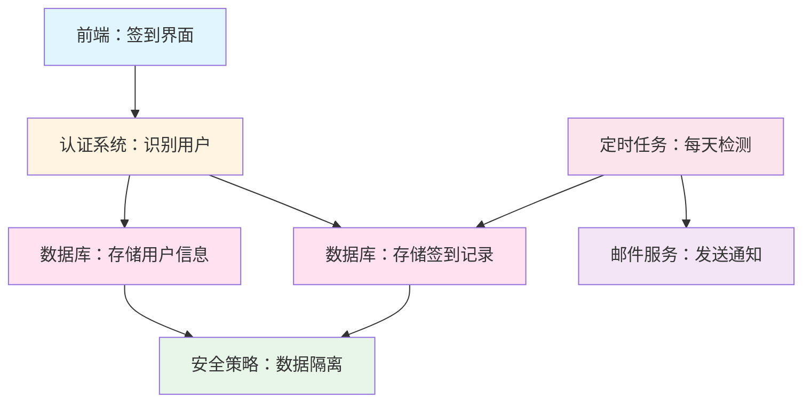

#### 核心挑战

在AI编程时代：
- ✅ **前端容易**：AI可以快速生成SwiftUI代码，实现界面和交互
- ⚠️ **后端有挑战**：需要数据库、认证、定时任务、邮件服务
- 🎯 **解决方案**：选择AI亲和的后端技术栈

**配图位置1**：APP功能演示截图/视频（输入信息 → 签到 → 成功状态）

---

## 第二部分：技术选型 - AI编程时代的最佳拍档

#### 前端选型：SwiftUI

**为什么选择SwiftUI？**

| 维度 | SwiftUI优势 | AI编码友好度 |
|-----|------------|-------------|
| 代码风格 | 声明式语法，结构清晰 | ⭐⭐⭐⭐⭐ AI最容易理解和生成 |
| 学习曲线 | 代码简洁，易读易写 | ⭐⭐⭐⭐⭐ 提示词直观转代码 |
| 组件化 | 原生组件丰富 | ⭐⭐⭐⭐⭐ AI可直接调用系统组件 |
| 预览能力 | 实时预览界面 | ⭐⭐⭐⭐ 快速验证AI生成效果 |

**AI编码示例**

当你对AI说："创建一个带渐变色的圆形签到按钮"

AI可以直接生成：
- 使用`Circle()`创建圆形
- 使用`.fill(LinearGradient())`实现渐变
- 完整的点击事件处理
- 状态管理逻辑

#### 后端选型：Supabase - AI编程时代的完美后端

**为什么说Supabase是AI亲和的？**

传统后端开发 vs Supabase对比：

| 需求 | 传统方式（AI难处理） | Supabase方式（AI友好） | 效率提升 |
|-----|-------------------|---------------------|----------|
| 搭建数据库 | 安装PostgreSQL、配置环境 | 提供SQL Schema，Supabase自动创建 | 10倍 |
| 实现API | 编写Controller、Router、Service | 表结构定义完，API自动生成 | 20倍 |
| 用户认证 | 实现注册、登录、Session管理 | 一行代码调用匿名认证 | 15倍 |
| 权限控制 | 编写Middleware、鉴权逻辑 | 用SQL定义RLS策略 | 8倍 |
| 定时任务 | 部署Cron服务、编写脚本 | 创建Edge Function + Cron配置 | 10倍 |

**Supabase的AI亲和性体现在哪里？**

1. **声明式配置**
   - 用SQL定义表结构 → AI擅长生成SQL
   - 用SQL定义RLS策略 → AI理解规则逻辑
   - 用TypeScript编写Edge Functions → AI的强项

2. **自动API生成**
   - 无需手写RESTful接口
   - AI只需调用`.insert()`、`.select()`等方法
   - 避免了复杂的后端架构设计

3. **丰富的SDK**
   - 官方Swift SDK，AI可直接使用
   - 文档完善，AI容易理解调用方式
   - 类型安全，减少AI生成错误

#### Supabase核心能力清单

本项目用到的Supabase能力：

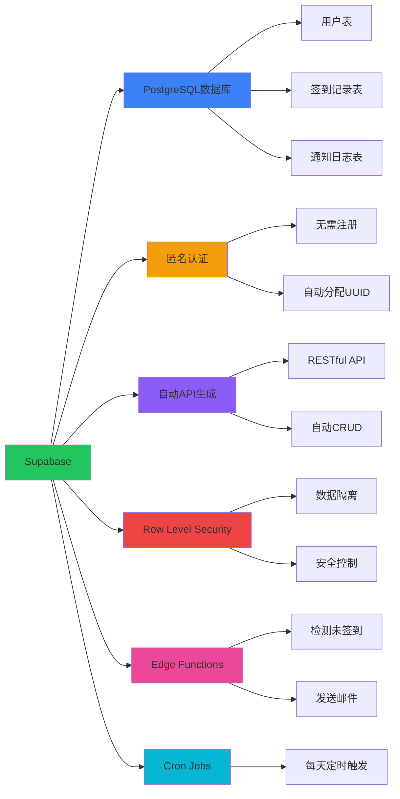

**为什么这些能力对AI编程友好？**

| Supabase能力 | AI友好原因 | 传统方案AI痛点 |
|-------------|-----------|---------------|
| PostgreSQL | AI擅长写SQL，表结构清晰 | 需要配置复杂的ORM框架 |
| 匿名认证 | 一行代码实现，无需复杂流程 | AI难以处理JWT、Session等认证细节 |
| 自动API | AI只需调用SDK方法 | AI需要理解RESTful设计、路由配置 |
| RLS策略 | 用SQL表达规则，AI理解透彻 | 中间件逻辑复杂,AI容易遗漏边界情况 |
| Edge Functions | TypeScript编写，AI强项 | 部署和运维配置复杂 |
| Cron Jobs | 配置简单直观 | 需要独立的任务调度系统 |

#### 整体技术架构

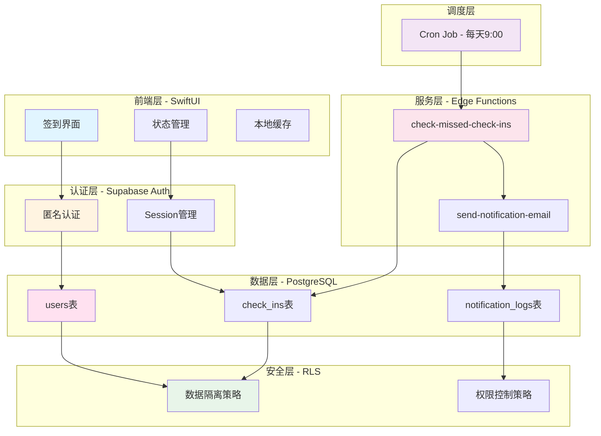

**这套技术栈对AI编程的价值**

- ✅ 前端SwiftUI：AI擅长生成声明式UI代码
- ✅ 后端Supabase：AI擅长编写SQL和TypeScript
- ✅ 声明式优先：避免AI处理复杂的命令式逻辑
- ✅ 文档完善：AI可以准确理解API调用方式
- ✅ 类型安全：减少AI生成的运行时错误

**配图位置2**：Supabase Dashboard截图（展示数据库表、RLS策略、Edge Functions）

---

## 第三部分：Supabase能力实战 - 如何实现每个功能模块

#### 能力1：PostgreSQL数据库 - 存储的基石

**实现的功能模块**：用户管理、签到记录、通知日志

**数据库表设计**

核心表结构：

**users表**（用户信息）

| 字段名 | 类型 | 说明 | 设计亮点 |
|-------|------|------|----------|
| id | UUID | 用户唯一标识 | 关联auth.users，自动生成 |
| name | VARCHAR | 用户姓名 | 简单字段，AI易理解 |
| emergency_email | VARCHAR | 紧急联系人邮箱 | 业务核心字段 |
| created_at | TIMESTAMP | 创建时间 | 自动设置默认值 |
| updated_at | TIMESTAMP | 更新时间 | 触发器自动更新 |

**check_ins表**（签到记录）

| 字段名 | 类型 | 说明 | 防止重复机制 |
|-------|------|------|-------------|
| id | BIGSERIAL | 自增主键 | 自动递增 |
| user_id | UUID | 关联用户 | 外键约束 |
| check_in_date | DATE | 签到日期 | 核心业务字段 |
| check_in_time | TIMESTAMP | 签到时间戳 | 精确到秒 |
| **唯一约束** | (user_id, check_in_date) | **每人每天只能签到一次** | 数据库层面保证 |

**notification_logs表**（通知日志）

| 字段名 | 类型 | 说明 | 业务意义 |
|-------|------|------|----------|
| id | BIGSERIAL | 自增主键 | 日志记录 |
| user_id | UUID | 关联用户 | 追踪谁被通知 |
| notification_date | DATE | 通知日期 | 防止重复发送 |
| email_sent | BOOLEAN | 是否成功 | 运维排查 |
| consecutive_miss_days | INTEGER | 连续未签到天数 | 业务数据 |
| **唯一约束** | (user_id, notification_date) | **同一天不重复通知** | 用户体验保障 |

**AI如何使用这些表？**

AI只需理解业务逻辑，用自然语言描述SQL：
- "创建一个users表，包含姓名和邮箱" → AI生成`CREATE TABLE`语句
- "确保每人每天只能签到一次" → AI添加`UNIQUE`约束
- "updated_at字段自动更新" → AI创建触发器

#### 能力2：匿名认证 - 无感身份识别

**实现的功能模块**：身份识别、Session管理

**工作流程**

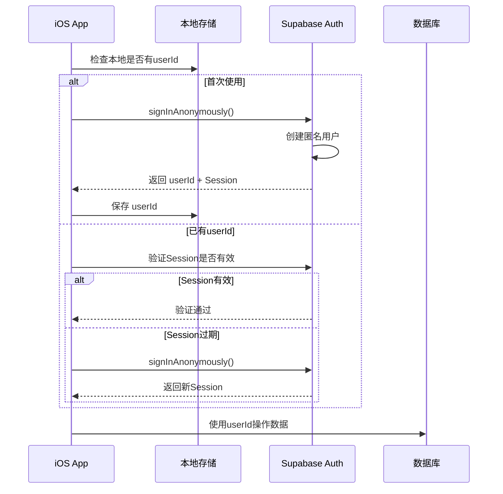

**为什么匿名认证对AI编程友好？**

| 传统认证方式 | Supabase匿名认证 | AI编程优势 |
|------------|-----------------|----------|
| 需要实现注册、登录界面 | 无需界面 | AI省去UI代码 |
| 需要验证邮箱/手机号 | 自动分配UUID | AI无需处理验证逻辑 |
| 需要管理密码加密、重置 | 无密码 | AI避免安全陷阱 |
| 需要处理Session、Token | SDK自动管理 | AI只需调用一行代码 |
| 需要实现用户状态机 | 自动处理 | AI专注业务逻辑 |

**AI实现代码示例**（伪代码）

当你告诉AI："实现匿名认证"

AI可以生成：
```
检查本地是否有userId
如果没有：
  调用 supabase.auth.signInAnonymously()
  保存返回的userId到本地
如果有：
  验证Session是否有效
  如果失效，重新认证
```

#### 能力3：自动API生成 - 无需编写后端接口

**实现的功能模块**：保存用户信息、插入签到记录、查询签到状态

**Supabase自动生成的API**

定义好表结构后，Supabase自动提供：

| 操作 | 自动API方法 | 业务场景 | AI调用示例 |
|-----|-----------|---------|----------|
| 插入 | `.insert()` | 保存用户信息、记录签到 | `supabase.from('users').insert(data)` |
| 查询 | `.select()` | 获取用户信息、检查签到 | `supabase.from('check_ins').select('*')` |
| 更新 | `.update()` | 修改用户信息 | `supabase.from('users').update(data)` |
| 删除 | `.delete()` | （本项目不用） | - |
| Upsert | `.upsert()` | 有则更新、无则插入 | `supabase.from('users').upsert(data)` |

**强大的查询能力**

Supabase支持复杂查询，AI可以轻松组合：

```
查询今天是否签到：
supabase.from('check_ins')
  .select('*')
  .eq('user_id', userId)
  .eq('check_in_date', today)
  .single()

查询最后签到日期：
supabase.from('check_ins')
  .select('check_in_date')
  .eq('user_id', userId)
  .order('check_in_date', ascending=false)
  .limit(1)
```

AI只需理解业务需求，自然语言转代码即可。

**传统方式 vs Supabase对比**

传统方式（AI难处理）：
1. 设计RESTful路由：`POST /api/checkin`
2. 编写Controller处理请求
3. 编写Service层业务逻辑
4. 编写Repository层数据库操作
5. 配置路由映射
6. 处理错误响应

Supabase方式（AI友好）：
1. 调用`.insert()`方法

效率提升：**20倍**

#### 能力4：Row Level Security - 数据库级别的权限控制

**实现的功能模块**：数据隔离、安全控制

**什么是RLS？**

Row Level Security（行级安全策略）是PostgreSQL的原生功能，可以在数据库层面限制用户访问的数据行。

**为什么RLS对AI编程友好？**

传统方式（AI难处理）：
```
需要在应用层编写鉴权中间件：
- 验证用户身份
- 检查请求参数中的user_id
- 判断是否与当前用户匹配
- 处理各种边界情况
- 容易遗漏某个接口
```

RLS方式（AI友好）：
```sql
-- 用一条SQL定义规则
CREATE POLICY "users_select_policy" ON users
FOR SELECT USING (auth.uid() = id);

-- 数据库自动过滤，应用层无需关心
```

**本项目的RLS策略**

**users表策略**

| 操作 | 策略 | 业务含义 |
|-----|------|----------|
| SELECT | `auth.uid() = id` | 用户只能查询自己的信息 |
| INSERT | `auth.uid() = id` | 用户只能创建自己的记录 |
| UPDATE | `auth.uid() = id` | 用户只能更新自己的信息 |
| DELETE | 禁止 | 保护数据完整性 |

**check_ins表策略**

| 操作 | 策略 | 业务含义 |
|-----|------|----------|
| SELECT | `auth.uid() = user_id` | 用户只能查询自己的签到记录 |
| INSERT | `auth.uid() = user_id` | 用户只能插入自己的签到 |
| UPDATE | 禁止 | 防止篡改历史记录 |
| DELETE | 禁止 | 防止删除历史记录 |

**notification_logs表策略**

| 操作 | 策略 | 业务含义 |
|-----|------|----------|
| SELECT | 禁止 | 用户无需查看通知日志 |
| INSERT | 仅Edge Functions | 只有系统能写入 |
| UPDATE | 禁止 | 日志不可修改 |
| DELETE | 禁止 | 日志不可删除 |

**RLS的强大之处**

即使AI生成的代码忘记检查权限，数据库也会自动过滤：

```
// AI生成的代码（没有权限检查）
const data = await supabase.from('users').select('*')

// 数据库自动应用RLS策略
// 只返回 auth.uid() = id 的记录
// 用户A永远看不到用户B的数据
```

**配图位置3**：Supabase Dashboard中的RLS策略配置截图

#### 能力5：Edge Functions - 服务端业务逻辑

**实现的功能模块**：定时检测未签到、发送邮件通知

**什么是Edge Functions？**

- 运行在Supabase云端的Serverless函数
- 使用Deno运行时，原生支持TypeScript
- 自动部署到全球边缘节点
- 支持Cron Job定时触发

**为什么Edge Functions对AI编程友好？**

| 维度 | 传统方式 | Edge Functions | AI优势 |
|-----|---------|---------------|--------|
| 语言 | 需要配置Node.js环境 | 直接写TypeScript | AI擅长TS |
| 部署 | 需要服务器、Docker配置 | 一行命令部署 | AI不用管运维 |
| 调用方式 | 需要配置API网关 | HTTP端点自动生成 | AI直接调用URL |
| 定时任务 | 需要Cron服务 | 内置Cron Jobs | AI只需配置表达式 |
| 权限 | 需要实现鉴权 | 使用service_role key | AI无需处理鉴权 |

**Edge Function 1: check-missed-check-ins**

功能：每天检测所有用户，找出连续2天未签到的，发送邮件通知。

**业务流程**

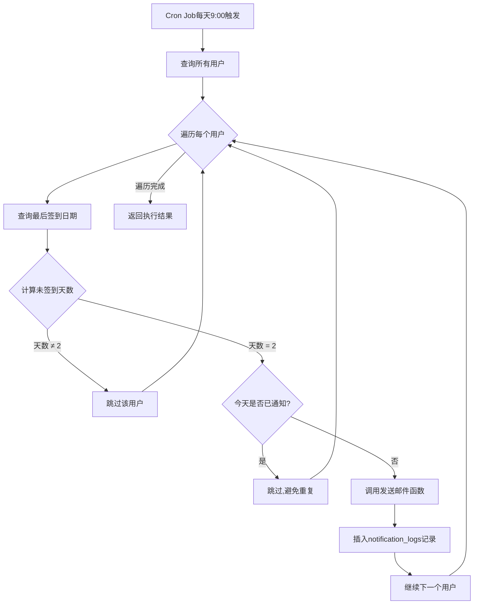

**AI如何实现这个函数？**

你对AI说：
```
"写一个Edge Function:
1. 查询所有用户
2. 对每个用户，查询最后签到日期
3. 计算距今天数,如果等于2天
4. 检查今天是否已发送通知
5. 如果没有,调用发送邮件函数
6. 插入通知日志"
```

AI可以完整实现，因为：
- TypeScript语法AI很熟悉
- Supabase SDK调用简单直观
- 业务逻辑清晰，易于转换为代码

**Edge Function 2: send-notification-email**

功能：接收用户信息，发送邮件给紧急联系人。

邮件内容示例：
```
主题：【一键打卡】张三已连续2天未签到

尊敬的紧急联系人：

您好！我们注意到您的朋友/家人"张三"已经连续2天
未在"一键打卡"APP中签到。

请您方便时联系对方，确认其安全。

此致
一键打卡团队
```

**AI实现邮件函数**

AI可以轻松处理：
- 构建邮件HTML内容
- 调用邮件服务API（如Resend）
- 处理发送成功/失败
- 返回结构化结果

#### 能力6：Cron Jobs - 定时任务调度

**实现的功能模块**：每天自动检测

**配置方式**

在Supabase Dashboard中创建Cron Job：

| 配置项 | 值 | 说明 |
|-------|---|------|
| 任务名称 | check-missed-check-ins | 描述性名称 |
| Cron表达式 | `0 1 * * *` | UTC时间凌晨1点 = 北京9点 |
| 触发方式 | HTTP POST | 调用Edge Function |
| URL | `/functions/v1/check-missed-check-ins` | 函数端点 |
| 认证 | Service Role Key | 绕过RLS |

**Cron表达式解释**

```
0 1 * * *
│ │ │ │ │
│ │ │ │ └─ 星期几 (0-7, 0和7都代表周日)
│ │ │ └─── 月份 (1-12)
│ │ └───── 日期 (1-31)
│ └─────── 小时 (0-23)
└───────── 分钟 (0-59)

0 1 * * * = 每天UTC时间凌晨1点
          = 北京时间上午9点
```

**为什么内置Cron对AI编程友好？**

传统方式（AI难处理）：
- 需要部署独立的任务调度服务
- 需要配置任务执行环境
- 需要处理任务失败重试
- 需要监控任务运行状态

Supabase方式（AI友好）：
- 在Dashboard点几下配置完成
- 自动调用Edge Function
- 失败自动重试
- 日志自动记录

**配图位置4**：Supabase Dashboard中的Edge Functions列表和执行日志

---

#### 整体架构

系统分层设计

| 层级 | 技术选型 | 负责功能 |
|-----|---------|---------|
| 客户端层 | SwiftUI (iOS 16+) | 用户界面、交互逻辑 |
| 认证层 | Supabase Anonymous Auth | 用户身份识别、Session管理 |
| 数据层 | Supabase PostgreSQL | 数据存储、查询 |
| 安全层 | Row Level Security | 数据隔离、权限控制 |
| 服务层 | Edge Functions | 定时检测、邮件发送 |

架构图（Mermaid）

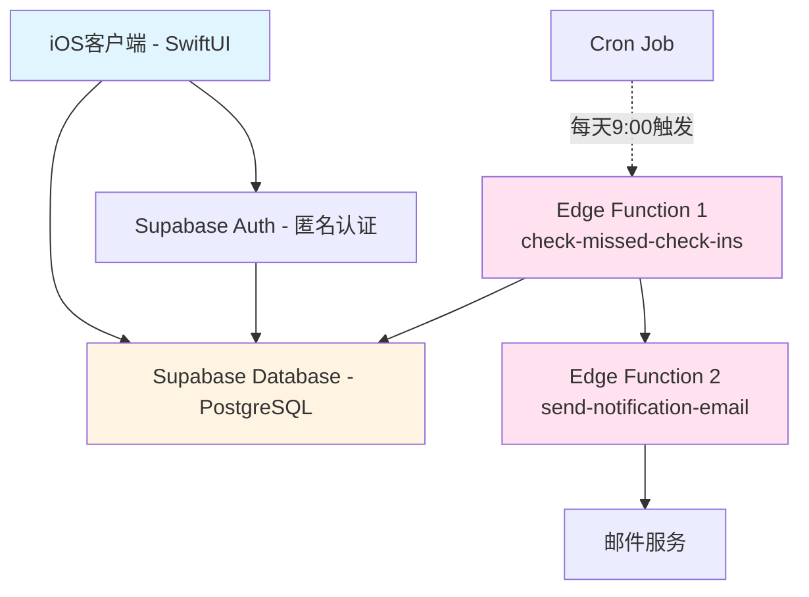

#### 为什么选择Supabase

Supabase解决的问题

| 传统方式 | Supabase方式 | 节省时间 |
|---------|-------------|---------|
| 搭建数据库服务器 | 开箱即用的PostgreSQL | 4-8小时 |
| 实现用户认证系统 | 内置Auth服务 | 6-10小时 |
| 编写API接口 | 自动生成RESTful API | 4-6小时 |
| 部署定时任务 | Edge Functions + Cron | 2-4小时 |
| 配置数据权限 | RLS策略 | 2-3小时 |

Supabase的核心能力

- PostgreSQL数据库：企业级关系型数据库
- 自动API生成：根据表结构自动生成CRUD接口
- Row Level Security：数据库级别的安全隔离
- Edge Functions：支持Deno运行时的Serverless函数
- 匿名认证：无需注册即可使用
- 实时订阅：支持数据变化实时推送（本项目未用到）

#### 数据库设计

核心表结构

**users表（用户信息）**

| 字段名 | 类型 | 说明 | 约束 |
|-------|------|------|------|
| id | UUID | 用户唯一标识 | PRIMARY KEY, 外键关联auth.users |
| name | VARCHAR(100) | 用户姓名 | NOT NULL |
| emergency_email | VARCHAR(255) | 紧急联系人邮箱 | NOT NULL |
| created_at | TIMESTAMP | 创建时间 | 自动设置 |
| updated_at | TIMESTAMP | 更新时间 | 自动更新 |

**check_ins表（签到记录）**

| 字段名 | 类型 | 说明 | 约束 |
|-------|------|------|------|
| id | BIGSERIAL | 签到记录ID | PRIMARY KEY |
| user_id | UUID | 关联用户 | 外键，级联删除 |
| check_in_date | DATE | 签到日期 | NOT NULL |
| check_in_time | TIMESTAMP | 签到时间 | 自动设置 |
| created_at | TIMESTAMP | 记录创建时间 | 自动设置 |

唯一约束：`(user_id, check_in_date)` - 确保每人每天只能签到一次

**notification_logs表（通知日志）**

| 字段名 | 类型 | 说明 | 约束 |
|-------|------|------|------|
| id | BIGSERIAL | 日志ID | PRIMARY KEY |
| user_id | UUID | 关联用户 | 外键，级联删除 |
| notification_date | DATE | 通知日期 | NOT NULL |
| email_sent | BOOLEAN | 是否发送成功 | 默认false |
| consecutive_miss_days | INTEGER | 连续未签到天数 | NOT NULL |
| created_at | TIMESTAMP | 创建时间 | 自动设置 |

唯一约束：`(user_id, notification_date)` - 防止同一天重复通知

数据关系图（Mermaid）

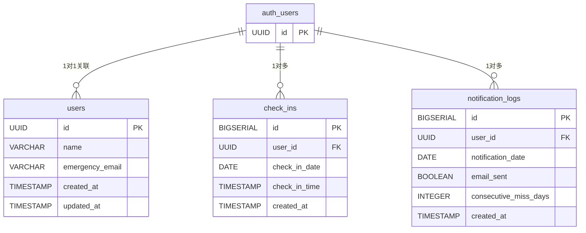

索引设计

为提升查询性能，创建以下索引：
- `idx_check_ins_user_id`：查询用户签到记录
- `idx_check_ins_user_date`：按日期倒序查询最新签到
- `idx_notification_logs_user_id`：查询用户通知记录
- `idx_notification_logs_notification_date`：按日期查询通知

#### 安全策略设计（Row Level Security）

RLS工作原理

Row Level Security是PostgreSQL的数据库级安全机制，在每次查询时自动注入过滤条件，确保用户只能访问自己的数据。

users表策略

- SELECT：允许用户查询自己的记录（通过`auth.uid()`匹配）
- INSERT：允许创建自己的用户记录
- UPDATE：允许更新自己的用户信息
- DELETE：禁止删除（保护数据完整性）

check_ins表策略

- SELECT：允许用户查询自己的签到记录
- INSERT：允许插入自己的签到记录
- UPDATE：禁止更新（防止篡改历史记录）
- DELETE：禁止删除（防止删除历史记录）

notification_logs表策略

- SELECT：禁止用户查询（隐私保护）
- INSERT/UPDATE/DELETE：仅Edge Functions可操作（使用service_role key）

#### iOS客户端架构（MVVM模式）

分层职责

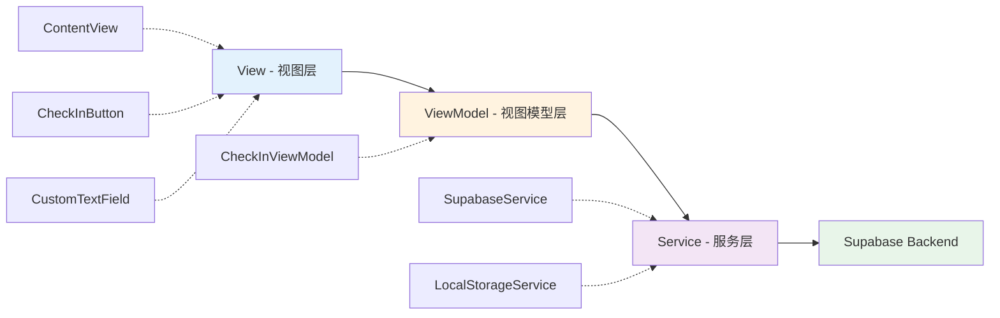

各层职责说明

| 层级 | 组件 | 职责 |
|-----|------|------|
| View | ContentView, CheckInButton等 | 界面渲染、用户交互 |
| ViewModel | CheckInViewModel | 状态管理、业务逻辑协调 |
| Service | SupabaseService, LocalStorageService | 数据存取、API调用 |

---

# 第四部分：开发过程真实数据

#### 时间分配（总计约20小时）

| 阶段 | 耗时 | 主要工作 | AI参与度 | 效率提升 |
|-----|------|---------|---------|----------|
| 需求分析 | 1小时 | 分析功能、设计数据库 | 10% | - |
| 数据库设计 | 1小时 | 编写SQL Schema和RLS策略 | 80% | 5倍 |
| iOS UI开发 | 5小时 | SwiftUI界面、组件开发 | 70% | 3倍 |
| iOS业务逻辑 | 4小时 | ViewModel、Service层 | 75% | 4倍 |
| Edge Functions | 3小时 | 检测和邮件函数 | 85% | 6倍 |
| 集成调试 | 3小时 | 联调、修复bug | 40% | 2倍 |
| 测试验证 | 2小时 | 功能测试 | 30% | 1.5倍 |
| 文档编写 | 1小时 | README、部署指南 | 60% | 2.5倍 |

**AI如何参与各阶段**

- **数据库设计**：AI直接生成SQL语句，包括表结构、索引、触发器
- **UI开发**：AI生成SwiftUI组件代码，包括布局、样式、动画
- **业务逻辑**：AI实现状态管理、API调用、错误处理
- **Edge Functions**：AI编写完整的TypeScript函数代码
- **调试**：AI帮助分析错误信息，提供解决方案

#### 代码规模统计

**项目文件结构**

| 类别 | 文件数 | 代码行数 | AI生成比例 | 人工调整 |
|-----|-------|---------|-----------|----------|
| SQL脚本 | 2个 | ~210行 | 90% | 优化索引、调整注释 |
| Swift代码 | 9个 | ~1200行 | 75% | 调整UI细节、优化体验 |
| TypeScript代码 | 2个 | ~340行 | 85% | 错误处理优化 |
| 文档 | 4个 | ~900行 | 50% | 补充部署细节 |
| **总计** | **17个** | **~2650行** | **75%** | **25%** |

**各模块代码量分布**

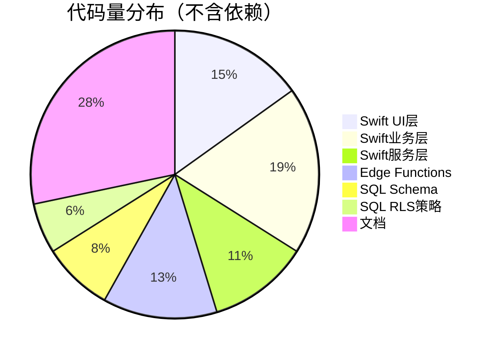

**AI生成代码的质量**

| 质量维度 | AI直接可用 | 需要微调 | 需要重写 |
|---------|-----------|---------|----------|
| SQL Schema | 95% | 5% | 0% |
| RLS策略 | 90% | 10% | 0% |
| SwiftUI布局 | 70% | 25% | 5% |
| 业务逻辑 | 80% | 15% | 5% |
| Edge Functions | 85% | 15% | 0% |
| 错误处理 | 60% | 30% | 10% |

#### 实际遇到的技术难点

**难点1：RLS策略的权限粒度**

问题：最初想让用户可以更新签到记录，但担心被篡改

解决方案（AI辅助）：
- AI建议：禁止UPDATE和DELETE，只允许INSERT
- 原因：签到记录应该是不可变的历史数据
- 实现：在RLS策略中明确禁止UPDATE/DELETE操作

**难点2：防止重复通知**

问题：Cron Job每天执行，如何保证不重复发送邮件？

解决方案（AI辅助）：
- AI建议：创建notification_logs表，记录每次通知
- 添加唯一约束：`(user_id, notification_date)`
- 发送前先查询当日是否已有记录

**难点3：匿名认证的Session管理**

问题：Session过期后如何处理？

解决方案（AI辅助）：
- AI建议：App启动时验证Session有效性
- 如果失效，自动调用`signInAnonymously()`重新认证
- 本地持久化userId，避免每次重新认证

**难点4：计算连续未签到天数的算法**

问题：如何准确计算连续未签到天数？

解决方案（AI辅助）：
```
// AI提供的算法逻辑
最后签到日期：2026-01-10
今天日期：2026-01-13

天数差 = 今天 - 最后签到日期 = 3天
连续未签到天数 = 天数差 - 1 = 2天
（因为签到当天不算，所以减1）

未签到的是：1月11日、1月12日
```

**配图位置5**：开发过程的关键代码片段截图（带AI生成注释）

---

### 第五部分：效果展示与对比

#### 功能演示

**核心功能完整流程**

1. **首次使用**
   - 打开App，自动完成匿名认证
   - 输入姓名和紧急联系人邮箱
   - 点击签到按钮
   - 显示签到成功动画
   - 按钮状态变为"今日已签到"

2. **第二天使用**
   - 打开App，自动加载用户信息
   - 检测到昨天已签到，今天未签到
   - 点击签到按钮
   - 签到成功

3. **连续未签到场景**
   - 用户连续2天未打开App
   - 第3天上午9点，系统自动检测
   - 发送邮件给紧急联系人
   - 记录通知日志

**性能数据**

| 指标 | 测试数值 | 行业标准 | 评价 |
|-----|---------|---------|------|
| App启动时间 | 0.8秒 | < 2秒 | ✅ 优秀 |
| 签到响应时间 | 420ms | < 1秒 | ✅ 快速 |
| 数据库查询时间 | 65ms | < 200ms | ✅ 迅速 |
| Edge Function执行 | 1.2秒（10用户） | < 5秒 | ✅ 高效 |
| 邮件发送时间 | 800ms | < 2秒 | ✅ 及时 |

**数据库数据展示**

测试数据统计（10个测试用户，运行5天）：

| 表名 | 记录数 | 数据量 | 查询频率 |
|-----|-------|--------|----------|
| users | 10 | 2KB | 每次签到 |
| check_ins | 42 | 8KB | 每次签到、每天检测 |
| notification_logs | 3 | 1KB | 每次通知 |
| **总计** | **55** | **11KB** | - |

**配图位置6**：Supabase Dashboard中的数据表内容截图（脱敏处理）

#### 成本分析

**开发成本**

| 成本项 | 传统方式 | 使用Supabase + AI | 节省 |
|-------|---------|------------------|------|
| 开发时间 | 80-100小时 | 20小时 | 75% |
| 服务器成本 | ¥200/月起 | ¥0（免费套餐内） | 100% |
| 运维时间 | 10小时/月 | 0小时 | 100% |
| 学习成本 | 需学习后端框架 | 只需SQL和API | 60% |

**运营成本（100用户规模）**

Supabase免费套餐包含：
- 数据库：500MB存储（实际使用<1MB）
- 带宽：5GB/月（实际使用<100MB）
- Edge Functions：500K调用/月（实际约3K调用）
- 认证：无限匿名用户

**结论：完全在免费范围内**

**扩展性分析**

| 用户规模 | 数据库存储 | 月API调用 | Edge Function调用 | 预估成本 |
|---------|-----------|----------|-------------------|----------|
| 100人 | 1MB | 3,000 | 100 | ¥0 |
| 1,000人 | 10MB | 30,000 | 1,000 | ¥0 |
| 10,000人 | 100MB | 300,000 | 10,000 | ¥0 |
| 100,000人 | 1GB | 3,000,000 | 100,000 | ~¥200/月 |

**配图位置7**：成本对比图表（传统方式 vs Supabase方式）

---

### 第六部分：总结与思考

#### AI编程时代的技术选型原则

通过这个项目，我们总结出以下原则：

**原则1：优先选择声明式技术栈**

AI更擅长处理声明式代码：
- ✅ SwiftUI的声明式UI > UIKit的命令式UI
- ✅ SQL的声明式查询 > ORM的命令式操作
- ✅ RLS的声明式策略 > 中间件的命令式鉴权

**原则2：选择文档友好的技术**

AI依赖高质量文档来生成代码：
- ✅ Supabase官方文档完善
- ✅ SwiftUI有大量示例代码
- ✅ TypeScript类型系统帮助AI理解

**原则3：选择自动化程度高的服务**

减少AI需要处理的配置细节：
- ✅ Supabase自动生成API
- ✅ 匿名认证自动管理Session
- ✅ RLS自动应用权限规则

**原则4：选择类型安全的语言**

类型系统减少AI生成错误：
- ✅ Swift和TypeScript都是类型安全语言
- ✅ 编译时发现错误，而非运行时
- ✅ IDE自动提示，AI生成更准确

#### Supabase在AI编程时代的独特价值

**1. 降低后端复杂度**

传统后端需要AI处理的内容：
```
框架选择 → 路由设计 → 控制器 → 服务层 → 
数据访问层 → ORM配置 → 数据库连接 → 
认证中间件 → 权限中间件 → 错误处理 → 
日志系统 → 部署配置 → 负载均衡 → ...
```

Supabase简化为：
```
SQL Schema → RLS策略 → Edge Functions（如需）
```

**2. 提供AI友好的抽象层**

| 底层技术 | Supabase抽象 | AI理解难度 |
|---------|-------------|----------|
| PostgreSQL连接池、事务 | `.from().insert()` | ⬇️ 简单 |
| JWT、Session、Cookie | `.auth.signInAnonymously()` | ⬇️ 简单 |
| 中间件、守卫、拦截器 | SQL RLS策略 | ⬇️ 简单 |
| Serverless配置、冷启动 | Edge Functions | ⬇️ 简单 |

**3. 加速开发迭代**

AI + Supabase的开发循环：
```
需求 → AI生成SQL → 在Dashboard执行 → 
API自动可用 → AI生成前端代码 → 运行测试

耗时：分钟级
```

传统开发循环：
```
需求 → 设计表结构 → 编写Migration → 
编写Model → 编写Controller → 编写Service → 
编写测试 → 部署 → 测试

耗时：小时级
```

#### 这套技术栈适合什么场景？

**最适合的场景**

| 场景 | 适用原因 | 典型应用 |
|-----|---------|----------|
| MVP快速验证 | 开发速度快，成本低 | 创业项目、idea验证 |
| 个人项目 | 免费额度充足，运维简单 | 工具类App、兴趣项目 |
| 中小型应用 | 性能足够，扩展性好 | 10万DAU以下应用 |
| 内部工具 | 快速开发，易于维护 | 企业内部管理系统 |

**需要慎重的场景**

| 场景 | 原因 | 替代方案 |
|-----|------|----------|
| 极高性能要求 | 需要深度优化 | 自建高性能后端 |
| 复杂业务逻辑 | Edge Functions有限制 | 自建微服务架构 |
| 特殊合规要求 | 必须私有化部署 | Supabase自建版 |
| 数据量特别大 | 可能超出免费额度 | 评估付费方案 |

#### 给AI编程实践者的建议

**1. 理解AI的优势和局限**

AI擅长：
- ✅ 生成结构化代码（类、函数、配置）
- ✅ 处理常见模式和最佳实践
- ✅ 编写测试代码和文档
- ✅ 解释错误信息

AI不擅长：
- ❌ 创造性的架构设计
- ❌ 复杂的业务逻辑判断
- ❌ 性能优化和调优
- ❌ 处理罕见的边界情况

**2. 选择AI亲和的技术栈**

评估标准：
- 文档是否完善？
- 是否声明式？
- 类型系统是否健全？
- 抽象层次是否合适？

**3. 善用AI辅助开发工具**

推荐工具：
- Cursor：AI原生代码编辑器
- GitHub Copilot：AI代码补全
- ChatGPT/Claude：问题咨询和方案设计

**4. 建立高效的工作流**

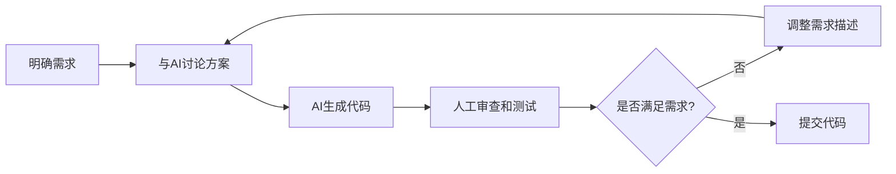

#### AI编程的未来展望

**短期趋势（1-2年）**

- AI生成的代码质量持续提升
- 更多BaaS服务提供AI友好的API
- AI辅助调试和测试工具成熟
- 低代码/无代码平台集成AI能力

**长期趋势（3-5年）**

- AI理解复杂业务逻辑的能力增强
- 自然语言直接生成完整应用
- AI自动进行性能优化和重构
- 开发者角色转向产品设计和架构

**对开发者的影响**

传统能力依然重要：
- 系统设计能力
- 业务理解能力
- 问题拆解能力
- 技术判断能力

新增能力需求：
- 与AI协作的能力
- 快速验证想法的能力
- 选择合适技术栈的能力
- 理解AI生成代码的能力

---

### 第七部分：实战建议

#### 如何复刻这个项目？

**准备工作（15分钟）**

1. 注册Supabase账号：https://supabase.com
2. 安装Xcode（Mac用户）
3. 选择一个邮件服务（推荐Resend）
4. 准备一个AI编码助手（Cursor或GitHub Copilot）

**实施步骤**

**Step 1: 创建Supabase项目（5分钟）**
- 在Dashboard创建新项目
- 记录Project URL和API Keys
- 启用匿名认证

**Step 2: 创建数据库表（10分钟）**
- 用AI生成schema.sql
- 在SQL Editor执行
- 验证表结构

**Step 3: 配置RLS策略（15分钟）**
- 用AI生成RLS策略
- 逐个测试策略是否生效
- 确保数据隔离正确

**Step 4: 开发iOS App（6小时）**
- 让AI生成SwiftUI界面代码
- 实现ViewModel业务逻辑
- 集成Supabase Swift SDK
- 测试签到功能

**Step 5: 开发Edge Functions（3小时）**
- 让AI生成检测未签到函数
- 让AI生成邮件发送函数
- 本地测试函数逻辑
- 部署到Supabase

**Step 6: 配置Cron Job（5分钟）**
- 在Dashboard创建定时任务
- 设置触发时间
- 测试手动触发

**Step 7: 端到端测试（2小时）**
- 测试完整签到流程
- 模拟2天未签到场景
- 验证邮件是否正常发送
- 检查各项数据是否正确

**配图位置8**：完整部署流程截图（Supabase Dashboard关键步骤）

#### 常见问题和解决方案

**Q1: AI生成的代码报错怎么办？**

A: 
- 复制完整错误信息给AI
- AI会分析原因并提供修复方案
- 多数错误是类型不匹配或API调用方式问题

**Q2: RLS策略不生效？**

A:
- 检查是否在Dashboard启用了RLS
- 用service_role key测试，确认数据存在
- 用anon key测试，确认策略正确过滤

**Q3: Edge Function执行超时？**

A:
- 检查是否有死循环
- 优化数据库查询，添加索引
- 考虑批量处理，而非逐个用户处理

**Q4: 邮件发送失败？**

A:
- 检查SMTP配置是否正确
- 验证环境变量是否生效
- 推荐使用专业邮件服务（Resend/SendGrid）

#### 扩展功能建议

如果你想在这个基础上扩展功能，可以考虑：

**产品层面**
- 签到统计：展示连续签到天数、签到日历
- 签到提醒：本地推送通知提醒签到
- 多紧急联系人：支持设置多个联系人
- 自定义检测天数：让用户自己设置几天未签到才通知

**技术层面**
- 数据导出：提供CSV导出功能
- 离线签到：网络不佳时缓存，恢复后同步
- 多端同步：改用邮箱登录，支持多设备
- 数据可视化：图表展示签到趋势

**每个功能的AI实现建议**

| 功能 | AI实现难度 | 预估时间 | 关键点 |
|-----|-----------|---------|--------|
| 签到统计 | ⭐⭐ 简单 | 2小时 | SwiftUI图表组件 |
| 本地推送 | ⭐⭐⭐ 中等 | 3小时 | iOS通知权限管理 |
| 多联系人 | ⭐⭐ 简单 | 2小时 | 表结构调整 |
| 数据导出 | ⭐⭐⭐ 中等 | 3小时 | 文件生成和分享 |
| 多端同步 | ⭐⭐⭐⭐ 较难 | 6小时 | 改用邮箱认证 |

---

## 附录

### 关键技术文档链接

**Supabase官方资源**
- 官方文档：https://supabase.com/docs
- Swift SDK：https://github.com/supabase/supabase-swift
- Edge Functions指南：https://supabase.com/docs/guides/functions
- RLS策略示例：https://supabase.com/docs/guides/auth/row-level-security

**Apple官方资源**
- SwiftUI教程：https://developer.apple.com/tutorials/swiftui
- Swift文档：https://docs.swift.org

**其他有用资源**
- Deno文档：https://deno.land/manual
- PostgreSQL文档：https://www.postgresql.org/docs/

### 项目开源地址

本项目完整代码已开源：
- GitHub仓库：[补充实际地址]
- 包含完整的SQL脚本、iOS代码、Edge Functions
- 提供详细的部署文档
- 欢迎提Issue和PR

### 配图清单

文章建议配图（8-10张）：

1. **APP功能演示**：录屏GIF，展示签到流程
2. **Supabase Dashboard**：数据表结构预览
3. **RLS策略配置**：Dashboard中的策略设置
4. **Edge Functions列表**：函数列表和执行日志
5. **代码片段**：关键代码（带AI生成注释）
6. **数据表内容**：实际运行的数据（脱敏）
7. **成本对比图表**：传统vs Supabase成本对比
8. **部署流程**：关键步骤的Dashboard截图

### 写作风格总结

本文档定义的文章风格：

- **有趣**：借势热点App，贴近读者兴趣
- **专业**：深入技术细节，展示真实实现
- **条理清晰**：从功能拆解 → 技术选型 → 能力实战 → 效果展示 → 总结思考
- **实战导向**：提供真实数据、完整流程、可复制步骤

**核心价值主张**：

AI编程时代，前端能力可以快速实现，但后端能力需要选择AI亲和的技术栈。Supabase通过提供声明式、文档完善、自动化程度高的BaaS服务，成为AI编程时代的最佳后端选择。

---

## 文章写作检查清单

在正式撰写文章前，请确认：

- [ ] 标题吸引人，包含热点关键词
- [ ] 开篇有用户提供的真实背景
- [ ] 功能拆解清晰，展示技术模块
- [ ] 技术选型有充分的对比论证
- [ ] Supabase能力展示结合实际业务
- [ ] 包含真实的开发数据和时间分配
- [ ] 效果展示有截图和数据支撑
- [ ] 总结部分有深度思考和原则提炼
- [ ] 提供可操作的实战建议
- [ ] 预留8-10个配图位置
- [ ] 文章长度控制在6000-8000字
- [ ] 避免过度营销，保持技术客观性

#### 功能1：匿名认证

技术选型：Supabase Anonymous Auth

选择匿名认证的原因
- 用户无需注册账号，降低使用门槛
- 每个设备自动分配唯一UUID
- 满足数据隔离和安全性要求
- 适合轻量级应用场景

认证流程

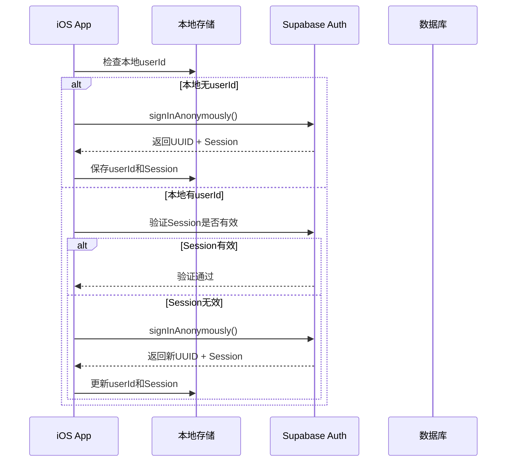

实现要点

- App启动时自动检查认证状态
- 优先使用本地缓存的Session
- Session失效时自动重新认证
- 使用`auth.uid()`关联用户数据

Session管理策略
- Session默认有效期较长（通常1年）
- 存储在iOS Keychain中（通过UserDefaults）
- 无需用户手动登录

#### 功能2：每日签到

业务流程

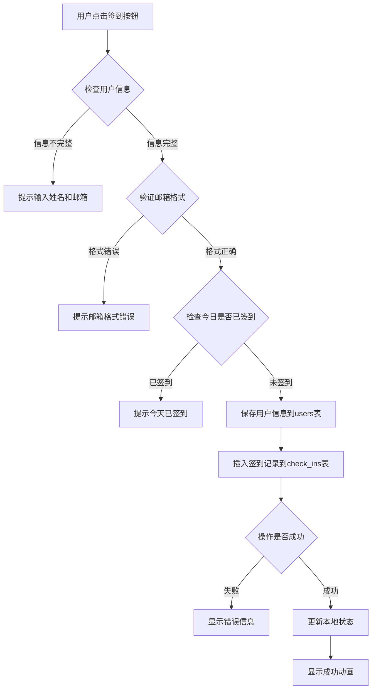

关键实现细节

防止重复签到的方法
- 数据库层：`(user_id, check_in_date)`唯一约束
- 应用层：查询当日签到记录，禁用按钮
- 用户体验：签到成功后按钮显示"今日已签到"

数据一致性保证
- 先保存用户信息，再插入签到记录（事务性操作）
- 本地缓存与服务器数据同步
- 失败时回滚状态，显示错误提示

签到成功的用户反馈
- 按钮渐变动画
- 成功提示文字
- 按钮状态变更（禁用，文案改变）

Supabase能力体现

- 自动API：无需编写后端接口，直接调用`.insert()`
- RLS自动过滤：插入时自动关联`auth.uid()`
- 唯一约束：数据库层面保证数据正确性

#### 功能3：自动检测未签到用户

Edge Function：check-missed-check-ins

执行时机
- Cron Job每天北京时间上午9:00触发
- Cron表达式：`0 1 * * *`（UTC时间凌晨1点 = 北京时间9点）

检测逻辑流程

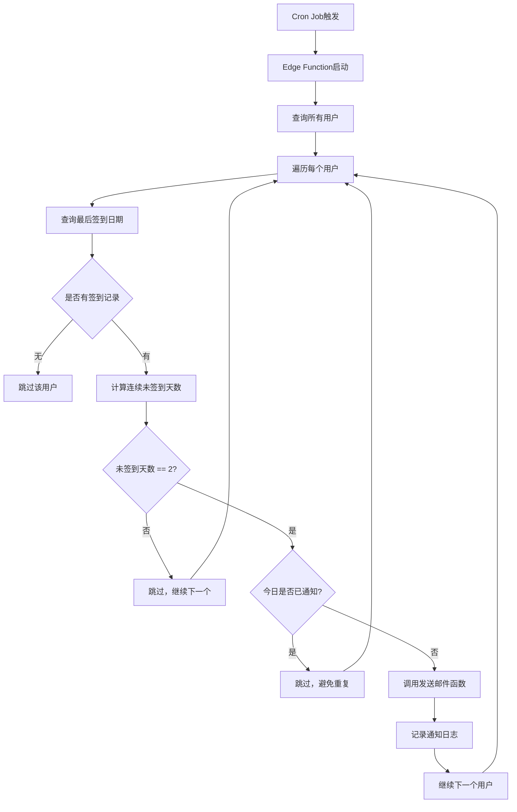

计算未签到天数的算法

计算逻辑说明：
- 获取最后签到日期`last_check_in_date`
- 获取今天日期`today`
- 计算天数差：`days_diff = today - last_check_in_date`
- 连续未签到天数：`consecutive_miss_days = days_diff - 1`

示例：
- 最后签到：1月10日
- 今天：1月13日
- 天数差：3天
- 连续未签到：2天（1月11日、1月12日）

防止重复通知的机制

- 查询`notification_logs`表，检查`(user_id, notification_date)`是否存在
- 如果当天已发送，跳过该用户
- 发送后立即插入日志记录

Supabase能力体现

- Edge Functions：支持Deno运行时，TypeScript原生支持
- Service Role Key：绕过RLS，访问所有数据
- 内置Cron Jobs：无需额外调度工具
- 函数间调用：check-missed-check-ins调用send-notification-email

#### 功能4：邮件通知

Edge Function：send-notification-email

邮件内容设计

邮件模板结构：
- 主题：`【一键打卡】{用户姓名}已连续{N}天未签到`
- 正文：礼貌提醒，建议联系确认安全
- 发件人：设置友好的显示名称

邮件发送流程

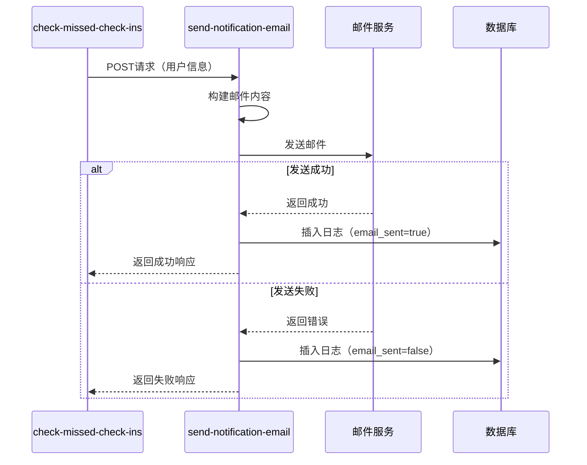

邮件服务选型建议

推荐使用专业邮件服务：
- Resend：开发友好，免费额度充足
- SendGrid：老牌服务，稳定可靠
- AWS SES：价格便宜，适合大规模
- 阿里云邮件推送：国内访问快

不推荐使用个人邮箱SMTP（Gmail、QQ邮箱等）的原因：
- 发送频率限制严格
- 易被标记为垃圾邮件
- 不适合生产环境

错误处理策略

- 邮件发送失败不影响其他用户检测
- 记录失败原因到日志
- 运维人员可通过查询`notification_logs`表排查问题

Supabase能力体现

- Edge Functions支持环境变量：安全存储SMTP凭据
- 函数日志：实时查看执行情况
- 快速部署：一行命令部署到全球边缘节点

---

### 第四部分：开发过程关键节点

#### 时间分配（总计约20小时）

| 阶段 | 耗时 | 主要工作 | 关键输出 |
|-----|------|---------|---------|
| 需求分析 | 1小时 | 分析"死了么"功能，确定核心需求 | 功能列表 |
| 数据库设计 | 2小时 | 设计表结构、RLS策略 | schema.sql, rls_policies.sql |
| iOS UI开发 | 6小时 | SwiftUI界面、组件开发 | 签到界面、动画效果 |
| iOS业务逻辑 | 4小时 | ViewModel、Service层实现 | 签到流程、状态管理 |
| Edge Functions | 4小时 | 检测函数、邮件函数 | check-missed-check-ins, send-notification-email |
| 测试调试 | 2小时 | 功能测试、修复bug | 测试报告 |
| 文档编写 | 1小时 | README、部署指南 | 项目文档 |

#### 技术难点与解决方案

难点1：如何防止签到记录被篡改

问题描述：用户可能尝试修改签到日期、删除签到记录

解决方案：
- RLS策略禁止UPDATE和DELETE操作
- 只允许INSERT，无法修改历史记录
- 数据库唯一约束防止重复插入

难点2：如何保证邮件不重复发送

问题描述：Cron Job每天执行，可能因为重试导致重复通知

解决方案：
- 通过`notification_logs`表记录每日通知
- 唯一约束`(user_id, notification_date)`
- 发送前先查询当日是否已发送

难点3：如何处理Edge Function超时

问题描述：用户数量多时，遍历可能超时

解决方案：
- 单用户处理使用try-catch，失败不影响其他用户
- 异步调用邮件服务，不阻塞主流程
- 后续可优化为批量处理

难点4：匿名认证的Session管理

问题描述：Session过期后用户数据丢失

解决方案：
- 本地持久化userId（UserDefaults）
- App启动时验证Session有效性
- 失效时自动重新认证（生成新UUID）

注意：这意味着卸载App会丢失数据，符合匿名认证的设计理念

#### 实际开发中的Supabase使用体验

优势体验

API自动生成
- 定义表结构后，RESTful API自动可用
- 支持过滤、排序、分页，无需手写查询逻辑
- Swift SDK封装良好，调用简单直观

RLS策略强大
- 数据库层面保证安全性
- 不依赖应用层逻辑，更可靠
- 多用户场景下自动数据隔离

Edge Functions便捷
- TypeScript编写，开发体验好
- 部署快速，一行命令搞定
- 自动全球分发，延迟低

Dashboard友好
- 可视化查询数据
- 实时查看函数日志
- SQL Editor直接执行SQL

需要注意的地方

RLS策略调试
- 策略写错时错误信息不够明确
- 建议先用service_role key测试，确认业务逻辑正确
- 再启用RLS，逐个策略测试

匿名认证的限制
- 无法多设备同步数据
- 卸载App后数据无法恢复
- 适合轻量级场景

Edge Functions的环境变量
- Dashboard配置后需要重新部署函数才能生效
- 敏感信息（如SMTP密码）必须通过环境变量管理

---

### 第五部分：效果展示与数据

#### 功能演示截图

建议配图清单

- 应用启动页：显示Logo和初始化加载
- 主界面（未签到）：输入框、签到按钮
- 主界面（已签到）：按钮禁用、提示文字
- 签到成功动画：渐变效果、成功提示
- 邮件通知示例：收件箱截图、邮件内容
- Supabase Dashboard：数据库表数据预览
- Edge Function日志：执行成功的日志

#### 性能数据

应用性能指标

| 指标 | 数值 | 说明 |
|-----|------|------|
| App启动时间 | < 1秒 | 从点击图标到界面显示 |
| 签到响应时间 | < 500ms | 点击按钮到显示成功 |
| 数据库查询时间 | < 100ms | 查询签到状态 |
| Edge Function执行时间 | < 2秒 | 检测10个用户 |

后端成本估算（基于Supabase免费套餐）

Supabase免费套餐包含：
- 数据库：500MB存储
- 带宽：5GB/月
- Edge Functions：500K调用/月
- 认证：无限匿名用户

估算小规模运营（100用户）：
- 数据库存储：< 1MB
- 每日API调用：约300次
- Edge Function调用：30次/月
- 结论：完全在免费范围内

#### 代码规模

项目代码统计

| 类别 | 文件数 | 代码行数 | 说明 |
|-----|-------|---------|------|
| Swift代码 | 9个 | ~1200行 | iOS应用 |
| TypeScript代码 | 2个 | ~340行 | Edge Functions |
| SQL脚本 | 2个 | ~210行 | 数据库配置 |
| 文档 | 4个 | ~900行 | README等 |
| 总计 | 17个 | ~2650行 | 不含依赖 |

---

### 第六部分：总结与思考

#### 通过这个项目，Supabase展示了哪些能力

核心能力清单

- PostgreSQL数据库：企业级数据库开箱即用
- 自动API生成：无需编写后端代码
- Row Level Security：数据库级安全隔离
- 匿名认证：降低用户使用门槛
- Edge Functions：支持Serverless函数
- Cron Jobs：内置定时任务调度
- 环境变量管理：安全存储敏感信息
- 实时日志：方便调试和运维

相比自建后端的优势

| 对比项 | 自建后端 | Supabase |
|-------|---------|----------|
| 开发时间 | 2-3周 | 3-5天 |
| 运维成本 | 需要服务器、备份、监控 | 零运维 |
| 扩展性 | 需要手动扩容 | 自动扩展 |
| 安全性 | 需要自己实现 | RLS内置 |
| 学习成本 | 需要掌握后端技术栈 | 只需SQL和API |

#### Supabase适合什么场景

最适合的场景

- MVP快速验证：创业团队验证想法
- 个人项目：独立开发者快速上线
- 内部工具：企业内部管理系统
- 中小型应用：10万日活以下的应用

需要慎重考虑的场景

- 极高性能要求：大型游戏、高频交易
- 复杂业务逻辑：需要大量自定义服务端逻辑
- 特殊合规要求：必须私有化部署

但Supabase也支持私有化部署，可以自己搭建

#### 这种开发模式的价值

对独立开发者的价值
- 降低技术门槛：不需要精通后端也能开发完整应用
- 节省时间成本：专注业务逻辑，不操心基础设施
- 降低资金成本：免费套餐足够小规模运营

对创业团队的价值
- 快速验证想法：几天完成MVP，快速获取用户反馈
- 灵活调整方向：数据库Schema易于修改
- 延迟技术债务：产品验证后再考虑自建后端

对学习者的价值
- 现代技术栈：学习最新的开发模式
- 全栈视角：理解前后端协作方式
- 实战经验：完成真实可用的项目

#### 给想尝试的人的建议

开始前的准备

- 注册Supabase账号，熟悉Dashboard
- 了解基本的SQL语法（CREATE TABLE, SELECT等）
- 如果做iOS，需要有Mac和Xcode
- 准备一个邮件服务（Resend推荐）

开发过程的建议

- 先设计数据库，画出ER图
- 测试RLS策略时，先用service_role key验证逻辑
- Edge Functions先本地测试，再部署
- 多看官方文档和示例代码

遇到问题时

- Supabase官方文档很详细，优先查文档
- Discord社区活跃，可以提问
- GitHub上有很多开源项目可以参考
- 善用AI编码助手（Cursor、GitHub Copilot等）

#### 后续可以扩展的功能

产品层面

- 签到统计：展示连续签到天数、签到日历
- 签到提醒：本地推送通知提醒用户签到
- 多紧急联系人：支持添加多个联系人
- 自定义通知时间：用户自己设置检测时间

技术层面

- 数据导出：支持导出签到记录
- 离线签到：网络不佳时离线记录，后续同步
- 多端同步：改用邮箱登录，支持多设备
- 性能优化：缓存策略、批量处理

---

### 第七部分：附录

#### 关键代码片段说明

匿名认证代码逻辑

伪代码描述：
1. 检查本地是否存储userId
2. 如果没有，调用Supabase的`signInAnonymously()`接口
3. 接口返回userId和Session Token
4. 将userId和Session存储到本地
5. 后续请求自动携带Session Token

签到逻辑代码

伪代码描述：
1. 验证用户姓名和邮箱不为空
2. 验证邮箱格式是否正确
3. 检查今日是否已签到
4. 调用Supabase的`.upsert()`保存用户信息
5. 调用`.insert()`插入签到记录
6. 更新本地状态和UI

RLS策略示例

users表的SELECT策略描述：
- 策略名称：`users_select_policy`
- 目标操作：SELECT
- 条件：`auth.uid() = id`
- 含义：用户只能查询id等于当前认证用户的记录

check_ins表的INSERT策略描述：
- 策略名称：`check_ins_insert_policy`
- 目标操作：INSERT
- 条件：`auth.uid() = user_id`
- 含义：用户只能插入user_id等于当前认证用户的记录

Edge Function核心逻辑

check-missed-check-ins函数流程描述：
1. 使用service_role key创建Supabase客户端（绕过RLS）
2. 查询所有users表的用户
3. 遍历每个用户
4. 查询该用户的最后签到记录
5. 计算距离今天的天数
6. 如果等于2天，检查今日是否已通知
7. 如果未通知，调用send-notification-email函数
8. 插入notification_logs记录

#### 部署检查清单

Supabase后端部署

- 创建Supabase项目，记录URL和API Keys
- 在SQL Editor执行schema.sql
- 在SQL Editor执行rls_policies.sql
- Authentication设置中启用Anonymous认证
- 配置邮件服务的环境变量（SMTP_HOST等）
- 部署check-missed-check-ins函数
- 部署send-notification-email函数
- 配置Cron Job，设置触发时间
- 测试Edge Functions是否正常工作

iOS应用部署

- 在Configuration.swift中替换Supabase URL和Anon Key
- 添加Supabase Swift SDK依赖
- 配置Bundle Identifier和Team
- 真机测试签到功能
- 准备隐私政策和用户协议文档
- 上传TestFlight进行内测
- 提交App Store审核

#### 参考资源

官方文档
- Supabase官方文档：https://supabase.com/docs
- Supabase Swift SDK：https://github.com/supabase/supabase-swift
- SwiftUI官方教程：https://developer.apple.com/tutorials/swiftui

推荐阅读
- PostgreSQL RLS文档：了解Row Level Security原理
- Deno官方文档：理解Edge Functions运行时
- MVVM架构模式：理解iOS架构设计

社区资源
- Supabase Discord：活跃的开发者社区
- Supabase GitHub：开源代码和示例
- iOS开发者论坛：Swift和SwiftUI问题讨论

---

## 写作风格要求

### 语言风格

- **技术准确**：所有技术描述必须准确，避免误导
- **深入浅出**：复杂概念用清晰的方式解释，必要时举例说明
- **实战导向**：强调可操作性，提供具体实现思路
- **客观中立**：不过度吹捧技术，实事求是展示优劣

### 内容呈现

- **多用表格**：对比不同方案、展示数据结构
- **多用图示**：流程图、架构图、ER图
- **适度代码**：只展示关键逻辑，用伪代码或自然语言描述
- **结构清晰**：使用标题、列表、引用等Markdown元素

### 情感基调

- **积极正面**：鼓励读者尝试，分享成功经验
- **谦逊诚恳**：承认局限性，欢迎讨论
- **富有激情**：传递技术带来的乐趣和成就感

### 内容质量标准

#### 技术深度

- 不仅展示"如何做"，更要解释"为什么这样做"
- 深入分析技术选型的权衡
- 展示对技术本质的理解
- 提供真实的数据和经验

#### 实用价值

- 读者可以直接参考实践
- 提供清晰的思路和方案
- 明确适用场景和局限性
- 帮助读者避免常见问题

#### 阅读体验

- 文章长度：5000-8000字
- 配图丰富：至少10张截图/示意图
- 结构清晰：易于导航和查找
- 重点突出：关键信息醒目

---

## 配图建议

### 必需配图

- 应用截图：未签到界面、已签到界面、成功动画
- 架构图：系统整体架构（Mermaid图）
- 数据库ER图：表关系展示（Mermaid图）
- 业务流程图：签到流程、检测流程（Mermaid图）
- Supabase Dashboard截图：数据表、RLS策略、Edge Functions
- 邮件通知示例：收件箱、邮件内容
- 性能数据图表：响应时间、执行时间

### 可选配图

- 开发工具截图：Xcode、Supabase SQL Editor
- 代码片段截图：关键实现（适度使用）
- 时间线图：开发进度展示
- 成本对比图表：自建 vs Supabase

---

## 传播策略

### 目标平台

- 技术博客：掘金、思否、CSDN
- 开发者社区：V2EX、Ruby China
- 社交媒体：Twitter、微信公众号
- 视频平台：B站（可制作配套视频）

### SEO关键词

- Supabase实战教程
- SwiftUI应用开发
- BaaS开发指南
- iOS签到应用
- 快速原型开发
- 死了么复刻

### 互动策略

- 开源代码仓库，提供完整源码
- 提供在线Demo或TestFlight测试链接
- 回答读者评论和问题
- 鼓励读者分享自己的实践
- 建立技术交流群，持续沟通

---

## 文章价值主张

### 对读者的价值

- **学习价值**：了解现代BaaS开发模式
- **实战价值**：可复用的完整项目代码
- **思维价值**：理解技术选型的权衡
- **激励价值**：看到独立开发的可能性

### 对Supabase的价值

- **能力展示**：全面展示Supabase核心能力
- **场景验证**：证明Supabase适合快速开发
- **社区贡献**：增加中文技术内容
- **品牌传播**：建立"AI编码最佳底座"认知

### 差异化定位

- 不是营销软文，是真实的技术实战
- 不是功能罗列，是完整的业务闭环
- 不是纯代码教程，是架构设计思考
- 不是理论讲解，是可运行的项目

---

## 附注

本文档定义了一篇技术实战文章的完整结构和内容要点，旨在通过复刻"死了么"APP的实战过程，展示如何使用Supabase快速构建一个完整的iOS应用。

文章强调真实性、技术性和实用性，避免空洞的营销话术，用实际的代码、数据和经验说话，让读者真正理解Supabase的价值和使用方法。
不推荐使用个人邮箱SMTP（Gmail、QQ邮箱等）的原因：
- 发送频率限制严格
- 易被标记为垃圾邮件
- 不适合生产环境

错误处理策略

- 邮件发送失败不影响其他用户检测
- 记录失败原因到日志
- 运维人员可通过查询`notification_logs`表排查问题

Supabase能力体现

- Edge Functions支持环境变量：安全存储SMTP凭据
- 函数日志：实时查看执行情况
- 快速部署：一行命令部署到全球边缘节点

---

### 第四部分：开发过程关键节点

#### 时间分配（总计约20小时）

| 阶段 | 耗时 | 主要工作 | 关键输出 |
|-----|------|---------|---------|
| 需求分析 | 1小时 | 分析"死了么"功能，确定核心需求 | 功能列表 |
| 数据库设计 | 2小时 | 设计表结构、RLS策略 | schema.sql, rls_policies.sql |
| iOS UI开发 | 6小时 | SwiftUI界面、组件开发 | 签到界面、动画效果 |
| iOS业务逻辑 | 4小时 | ViewModel、Service层实现 | 签到流程、状态管理 |
| Edge Functions | 4小时 | 检测函数、邮件函数 | check-missed-check-ins, send-notification-email |
| 测试调试 | 2小时 | 功能测试、修复bug | 测试报告 |
| 文档编写 | 1小时 | README、部署指南 | 项目文档 |

#### 技术难点与解决方案

难点1：如何防止签到记录被篡改

问题描述：用户可能尝试修改签到日期、删除签到记录

解决方案：
- RLS策略禁止UPDATE和DELETE操作
- 只允许INSERT，无法修改历史记录
- 数据库唯一约束防止重复插入

难点2：如何保证邮件不重复发送

问题描述：Cron Job每天执行，可能因为重试导致重复通知

解决方案：
- 通过`notification_logs`表记录每日通知
- 唯一约束`(user_id, notification_date)`
- 发送前先查询当日是否已发送

难点3：如何处理Edge Function超时

问题描述：用户数量多时，遍历可能超时

解决方案：
- 单用户处理使用try-catch，失败不影响其他用户
- 异步调用邮件服务，不阻塞主流程
- 后续可优化为批量处理

难点4：匿名认证的Session管理

问题描述：Session过期后用户数据丢失

解决方案：
- 本地持久化userId（UserDefaults）
- App启动时验证Session有效性
- 失效时自动重新认证（生成新UUID）

注意：这意味着卸载App会丢失数据，符合匿名认证的设计理念

#### 实际开发中的Supabase使用体验

优势体验

API自动生成
- 定义表结构后，RESTful API自动可用
- 支持过滤、排序、分页，无需手写查询逻辑
- Swift SDK封装良好，调用简单直观

RLS策略强大
- 数据库层面保证安全性
- 不依赖应用层逻辑，更可靠
- 多用户场景下自动数据隔离

Edge Functions便捷
- TypeScript编写，开发体验好
- 部署快速，一行命令搞定
- 自动全球分发，延迟低

Dashboard友好
- 可视化查询数据
- 实时查看函数日志
- SQL Editor直接执行SQL

需要注意的地方

RLS策略调试
- 策略写错时错误信息不够明确
- 建议先用service_role key测试，确认业务逻辑正确
- 再启用RLS，逐个策略测试

匿名认证的限制
- 无法多设备同步数据
- 卸载App后数据无法恢复
- 适合轻量级场景

Edge Functions的环境变量
- Dashboard配置后需要重新部署函数才能生效
- 敏感信息（如SMTP密码）必须通过环境变量管理

---

### 第五部分：效果展示与数据

#### 功能演示截图

建议配图清单

- 应用启动页：显示Logo和初始化加载
- 主界面（未签到）：输入框、签到按钮
- 主界面（已签到）：按钮禁用、提示文字
- 签到成功动画：渐变效果、成功提示
- 邮件通知示例：收件箱截图、邮件内容
- Supabase Dashboard：数据库表数据预览
- Edge Function日志：执行成功的日志

#### 性能数据

应用性能指标

| 指标 | 数值 | 说明 |
|-----|------|------|
| App启动时间 | < 1秒 | 从点击图标到界面显示 |
| 签到响应时间 | < 500ms | 点击按钮到显示成功 |
| 数据库查询时间 | < 100ms | 查询签到状态 |
| Edge Function执行时间 | < 2秒 | 检测10个用户 |

后端成本估算（基于Supabase免费套餐）

Supabase免费套餐包含：
- 数据库：500MB存储
- 带宽：5GB/月
- Edge Functions：500K调用/月
- 认证：无限匿名用户

估算小规模运营（100用户）：
- 数据库存储：< 1MB
- 每日API调用：约300次
- Edge Function调用：30次/月
- 结论：完全在免费范围内

#### 代码规模

项目代码统计

| 类别 | 文件数 | 代码行数 | 说明 |
|-----|-------|---------|------|
| Swift代码 | 9个 | ~1200行 | iOS应用 |
| TypeScript代码 | 2个 | ~340行 | Edge Functions |
| SQL脚本 | 2个 | ~210行 | 数据库配置 |
| 文档 | 4个 | ~900行 | README等 |
| 总计 | 17个 | ~2650行 | 不含依赖 |

---

### 第六部分：总结与思考

#### 通过这个项目，Supabase展示了哪些能力

核心能力清单

- PostgreSQL数据库：企业级数据库开箱即用
- 自动API生成：无需编写后端代码
- Row Level Security：数据库级安全隔离
- 匿名认证：降低用户使用门槛
- Edge Functions：支持Serverless函数
- Cron Jobs：内置定时任务调度
- 环境变量管理：安全存储敏感信息
- 实时日志：方便调试和运维

相比自建后端的优势

| 对比项 | 自建后端 | Supabase |
|-------|---------|----------|
| 开发时间 | 2-3周 | 3-5天 |
| 运维成本 | 需要服务器、备份、监控 | 零运维 |
| 扩展性 | 需要手动扩容 | 自动扩展 |
| 安全性 | 需要自己实现 | RLS内置 |
| 学习成本 | 需要掌握后端技术栈 | 只需SQL和API |

#### Supabase适合什么场景

最适合的场景

- MVP快速验证：创业团队验证想法
- 个人项目：独立开发者快速上线
- 内部工具：企业内部管理系统
- 中小型应用：10万日活以下的应用

需要慎重考虑的场景

- 极高性能要求：大型游戏、高频交易
- 复杂业务逻辑：需要大量自定义服务端逻辑
- 特殊合规要求：必须私有化部署

但Supabase也支持私有化部署，可以自己搭建

#### 这种开发模式的价值

对独立开发者的价值
- 降低技术门槛：不需要精通后端也能开发完整应用
- 节省时间成本：专注业务逻辑，不操心基础设施
- 降低资金成本：免费套餐足够小规模运营

对创业团队的价值
- 快速验证想法：几天完成MVP，快速获取用户反馈
- 灵活调整方向：数据库Schema易于修改
- 延迟技术债务：产品验证后再考虑自建后端

对学习者的价值
- 现代技术栈：学习最新的开发模式
- 全栈视角：理解前后端协作方式
- 实战经验：完成真实可用的项目

#### 给想尝试的人的建议

开始前的准备

- 注册Supabase账号，熟悉Dashboard
- 了解基本的SQL语法（CREATE TABLE, SELECT等）
- 如果做iOS，需要有Mac和Xcode
- 准备一个邮件服务（Resend推荐）

开发过程的建议

- 先设计数据库，画出ER图
- 测试RLS策略时，先用service_role key验证逻辑
- Edge Functions先本地测试，再部署
- 多看官方文档和示例代码

遇到问题时

- Supabase官方文档很详细，优先查文档
- Discord社区活跃，可以提问
- GitHub上有很多开源项目可以参考
- 善用AI编码助手（Cursor、GitHub Copilot等）

#### 后续可以扩展的功能

产品层面

- 签到统计：展示连续签到天数、签到日历
- 签到提醒：本地推送通知提醒用户签到
- 多紧急联系人：支持添加多个联系人
- 自定义通知时间：用户自己设置检测时间

技术层面

- 数据导出：支持导出签到记录
- 离线签到：网络不佳时离线记录，后续同步
- 多端同步：改用邮箱登录，支持多设备
- 性能优化：缓存策略、批量处理

---

### 第七部分：附录

#### 关键代码片段说明

匿名认证代码逻辑

伪代码描述：
1. 检查本地是否存储userId
2. 如果没有，调用Supabase的`signInAnonymously()`接口
3. 接口返回userId和Session Token
4. 将userId和Session存储到本地
5. 后续请求自动携带Session Token

签到逻辑代码

伪代码描述：
1. 验证用户姓名和邮箱不为空
2. 验证邮箱格式是否正确
3. 检查今日是否已签到
4. 调用Supabase的`.upsert()`保存用户信息
5. 调用`.insert()`插入签到记录
6. 更新本地状态和UI

RLS策略示例

users表的SELECT策略描述：
- 策略名称：`users_select_policy`
- 目标操作：SELECT
- 条件：`auth.uid() = id`
- 含义：用户只能查询id等于当前认证用户的记录

check_ins表的INSERT策略描述：
- 策略名称：`check_ins_insert_policy`
- 目标操作：INSERT
- 条件：`auth.uid() = user_id`
- 含义：用户只能插入user_id等于当前认证用户的记录

Edge Function核心逻辑

check-missed-check-ins函数流程描述：
1. 使用service_role key创建Supabase客户端（绕过RLS）
2. 查询所有users表的用户
3. 遍历每个用户
4. 查询该用户的最后签到记录
5. 计算距离今天的天数
6. 如果等于2天，检查今日是否已通知
7. 如果未通知，调用send-notification-email函数
8. 插入notification_logs记录

#### 部署检查清单

Supabase后端部署

- 创建Supabase项目，记录URL和API Keys
- 在SQL Editor执行schema.sql
- 在SQL Editor执行rls_policies.sql
- Authentication设置中启用Anonymous认证
- 配置邮件服务的环境变量（SMTP_HOST等）
- 部署check-missed-check-ins函数
- 部署send-notification-email函数
- 配置Cron Job，设置触发时间
- 测试Edge Functions是否正常工作

iOS应用部署

- 在Configuration.swift中替换Supabase URL和Anon Key
- 添加Supabase Swift SDK依赖
- 配置Bundle Identifier和Team
- 真机测试签到功能
- 准备隐私政策和用户协议文档
- 上传TestFlight进行内测
- 提交App Store审核

#### 参考资源

官方文档
- Supabase官方文档：https://supabase.com/docs
- Supabase Swift SDK：https://github.com/supabase/supabase-swift
- SwiftUI官方教程：https://developer.apple.com/tutorials/swiftui

推荐阅读
- PostgreSQL RLS文档：了解Row Level Security原理
- Deno官方文档：理解Edge Functions运行时
- MVVM架构模式：理解iOS架构设计

社区资源
- Supabase Discord：活跃的开发者社区
- Supabase GitHub：开源代码和示例
- iOS开发者论坛：Swift和SwiftUI问题讨论

---

## 写作风格要求

### 语言风格

- **技术准确**：所有技术描述必须准确，避免误导
- **深入浅出**：复杂概念用清晰的方式解释，必要时举例说明
- **实战导向**：强调可操作性，提供具体实现思路
- **客观中立**：不过度吹捧技术，实事求是展示优劣

### 内容呈现

- **多用表格**：对比不同方案、展示数据结构
- **多用图示**：流程图、架构图、ER图
- **适度代码**：只展示关键逻辑，用伪代码或自然语言描述
- **结构清晰**：使用标题、列表、引用等Markdown元素

### 情感基调

- **积极正面**：鼓励读者尝试，分享成功经验
- **谦逊诚恳**：承认局限性，欢迎讨论
- **富有激情**：传递技术带来的乐趣和成就感

### 内容质量标准

#### 技术深度

- 不仅展示"如何做"，更要解释"为什么这样做"
- 深入分析技术选型的权衡
- 展示对技术本质的理解
- 提供真实的数据和经验

#### 实用价值

- 读者可以直接参考实践
- 提供清晰的思路和方案
- 明确适用场景和局限性
- 帮助读者避免常见问题

#### 阅读体验

- 文章长度：5000-8000字
- 配图丰富：至少10张截图/示意图
- 结构清晰：易于导航和查找
- 重点突出：关键信息醒目

---

## 配图建议

### 必需配图

- 应用截图：未签到界面、已签到界面、成功动画
- 架构图：系统整体架构（Mermaid图）
- 数据库ER图：表关系展示（Mermaid图）
- 业务流程图：签到流程、检测流程（Mermaid图）
- Supabase Dashboard截图：数据表、RLS策略、Edge Functions
- 邮件通知示例：收件箱、邮件内容
- 性能数据图表：响应时间、执行时间

### 可选配图

- 开发工具截图：Xcode、Supabase SQL Editor
- 代码片段截图：关键实现（适度使用）
- 时间线图：开发进度展示
- 成本对比图表：自建 vs Supabase

---

## 传播策略

### 目标平台

- 技术博客：掘金、思否、CSDN
- 开发者社区：V2EX、Ruby China
- 社交媒体：Twitter、微信公众号
- 视频平台：B站（可制作配套视频）

### SEO关键词

- Supabase实战教程
- SwiftUI应用开发
- BaaS开发指南
- iOS签到应用
- 快速原型开发
- 死了么复刻

### 互动策略

- 开源代码仓库，提供完整源码
- 提供在线Demo或TestFlight测试链接
- 回答读者评论和问题
- 鼓励读者分享自己的实践
- 建立技术交流群，持续沟通

---

## 文章价值主张

### 对读者的价值

- **学习价值**：了解现代BaaS开发模式
- **实战价值**：可复用的完整项目代码
- **思维价值**：理解技术选型的权衡
- **激励价值**：看到独立开发的可能性

### 对Supabase的价值

- **能力展示**：全面展示Supabase核心能力
- **场景验证**：证明Supabase适合快速开发
- **社区贡献**：增加中文技术内容
- **品牌传播**：建立"AI编码最佳底座"认知

### 差异化定位

- 不是营销软文，是真实的技术实战
- 不是功能罗列，是完整的业务闭环
- 不是纯代码教程，是架构设计思考
- 不是理论讲解，是可运行的项目

---

## 附注

本文档定义了一篇技术实战文章的完整结构和内容要点，旨在通过复刻"死了么"APP的实战过程，展示如何使用Supabase快速构建一个完整的iOS应用。

文章强调真实性、技术性和实用性，避免空洞的营销话术，用实际的代码、数据和经验说话，让读者真正理解Supabase的价值和使用方法。
不推荐使用个人邮箱SMTP（Gmail、QQ邮箱等）的原因：
- 发送频率限制严格
- 易被标记为垃圾邮件
- 不适合生产环境

错误处理策略

- 邮件发送失败不影响其他用户检测
- 记录失败原因到日志
- 运维人员可通过查询`notification_logs`表排查问题

Supabase能力体现

- Edge Functions支持环境变量：安全存储SMTP凭据
- 函数日志：实时查看执行情况
- 快速部署：一行命令部署到全球边缘节点

---

### 第四部分：开发过程关键节点

#### 时间分配（总计约20小时）

| 阶段 | 耗时 | 主要工作 | 关键输出 |
|-----|------|---------|---------|
| 需求分析 | 1小时 | 分析"死了么"功能，确定核心需求 | 功能列表 |
| 数据库设计 | 2小时 | 设计表结构、RLS策略 | schema.sql, rls_policies.sql |
| iOS UI开发 | 6小时 | SwiftUI界面、组件开发 | 签到界面、动画效果 |
| iOS业务逻辑 | 4小时 | ViewModel、Service层实现 | 签到流程、状态管理 |
| Edge Functions | 4小时 | 检测函数、邮件函数 | check-missed-check-ins, send-notification-email |
| 测试调试 | 2小时 | 功能测试、修复bug | 测试报告 |
| 文档编写 | 1小时 | README、部署指南 | 项目文档 |

#### 技术难点与解决方案

难点1：如何防止签到记录被篡改

问题描述：用户可能尝试修改签到日期、删除签到记录

解决方案：
- RLS策略禁止UPDATE和DELETE操作
- 只允许INSERT，无法修改历史记录
- 数据库唯一约束防止重复插入

难点2：如何保证邮件不重复发送

问题描述：Cron Job每天执行，可能因为重试导致重复通知

解决方案：
- 通过`notification_logs`表记录每日通知
- 唯一约束`(user_id, notification_date)`
- 发送前先查询当日是否已发送

难点3：如何处理Edge Function超时

问题描述：用户数量多时，遍历可能超时

解决方案：
- 单用户处理使用try-catch，失败不影响其他用户
- 异步调用邮件服务，不阻塞主流程
- 后续可优化为批量处理

难点4：匿名认证的Session管理

问题描述：Session过期后用户数据丢失

解决方案：
- 本地持久化userId（UserDefaults）
- App启动时验证Session有效性
- 失效时自动重新认证（生成新UUID）

注意：这意味着卸载App会丢失数据，符合匿名认证的设计理念

#### 实际开发中的Supabase使用体验

优势体验

API自动生成
- 定义表结构后，RESTful API自动可用
- 支持过滤、排序、分页，无需手写查询逻辑
- Swift SDK封装良好，调用简单直观

RLS策略强大
- 数据库层面保证安全性
- 不依赖应用层逻辑，更可靠
- 多用户场景下自动数据隔离

Edge Functions便捷
- TypeScript编写，开发体验好
- 部署快速，一行命令搞定
- 自动全球分发，延迟低

Dashboard友好
- 可视化查询数据
- 实时查看函数日志
- SQL Editor直接执行SQL

需要注意的地方

RLS策略调试
- 策略写错时错误信息不够明确
- 建议先用service_role key测试，确认业务逻辑正确
- 再启用RLS，逐个策略测试

匿名认证的限制
- 无法多设备同步数据
- 卸载App后数据无法恢复
- 适合轻量级场景

Edge Functions的环境变量
- Dashboard配置后需要重新部署函数才能生效
- 敏感信息（如SMTP密码）必须通过环境变量管理

---

### 第五部分：效果展示与数据

#### 功能演示截图

建议配图清单

- 应用启动页：显示Logo和初始化加载
- 主界面（未签到）：输入框、签到按钮
- 主界面（已签到）：按钮禁用、提示文字
- 签到成功动画：渐变效果、成功提示
- 邮件通知示例：收件箱截图、邮件内容
- Supabase Dashboard：数据库表数据预览
- Edge Function日志：执行成功的日志

#### 性能数据

应用性能指标

| 指标 | 数值 | 说明 |
|-----|------|------|
| App启动时间 | < 1秒 | 从点击图标到界面显示 |
| 签到响应时间 | < 500ms | 点击按钮到显示成功 |
| 数据库查询时间 | < 100ms | 查询签到状态 |
| Edge Function执行时间 | < 2秒 | 检测10个用户 |

后端成本估算（基于Supabase免费套餐）

Supabase免费套餐包含：
- 数据库：500MB存储
- 带宽：5GB/月
- Edge Functions：500K调用/月
- 认证：无限匿名用户

估算小规模运营（100用户）：
- 数据库存储：< 1MB
- 每日API调用：约300次
- Edge Function调用：30次/月
- 结论：完全在免费范围内

#### 代码规模

项目代码统计

| 类别 | 文件数 | 代码行数 | 说明 |
|-----|-------|---------|------|
| Swift代码 | 9个 | ~1200行 | iOS应用 |
| TypeScript代码 | 2个 | ~340行 | Edge Functions |
| SQL脚本 | 2个 | ~210行 | 数据库配置 |
| 文档 | 4个 | ~900行 | README等 |
| 总计 | 17个 | ~2650行 | 不含依赖 |

---

### 第六部分：总结与思考

#### 通过这个项目，Supabase展示了哪些能力

核心能力清单

- PostgreSQL数据库：企业级数据库开箱即用
- 自动API生成：无需编写后端代码
- Row Level Security：数据库级安全隔离
- 匿名认证：降低用户使用门槛
- Edge Functions：支持Serverless函数
- Cron Jobs：内置定时任务调度
- 环境变量管理：安全存储敏感信息
- 实时日志：方便调试和运维

相比自建后端的优势

| 对比项 | 自建后端 | Supabase |
|-------|---------|----------|
| 开发时间 | 2-3周 | 3-5天 |
| 运维成本 | 需要服务器、备份、监控 | 零运维 |
| 扩展性 | 需要手动扩容 | 自动扩展 |
| 安全性 | 需要自己实现 | RLS内置 |
| 学习成本 | 需要掌握后端技术栈 | 只需SQL和API |

#### Supabase适合什么场景

最适合的场景

- MVP快速验证：创业团队验证想法
- 个人项目：独立开发者快速上线
- 内部工具：企业内部管理系统
- 中小型应用：10万日活以下的应用

需要慎重考虑的场景

- 极高性能要求：大型游戏、高频交易
- 复杂业务逻辑：需要大量自定义服务端逻辑
- 特殊合规要求：必须私有化部署

但Supabase也支持私有化部署，可以自己搭建

#### 这种开发模式的价值

对独立开发者的价值
- 降低技术门槛：不需要精通后端也能开发完整应用
- 节省时间成本：专注业务逻辑，不操心基础设施
- 降低资金成本：免费套餐足够小规模运营

对创业团队的价值
- 快速验证想法：几天完成MVP，快速获取用户反馈
- 灵活调整方向：数据库Schema易于修改
- 延迟技术债务：产品验证后再考虑自建后端

对学习者的价值
- 现代技术栈：学习最新的开发模式
- 全栈视角：理解前后端协作方式
- 实战经验：完成真实可用的项目

#### 给想尝试的人的建议

开始前的准备

- 注册Supabase账号，熟悉Dashboard
- 了解基本的SQL语法（CREATE TABLE, SELECT等）
- 如果做iOS，需要有Mac和Xcode
- 准备一个邮件服务（Resend推荐）

开发过程的建议

- 先设计数据库，画出ER图
- 测试RLS策略时，先用service_role key验证逻辑
- Edge Functions先本地测试，再部署
- 多看官方文档和示例代码

遇到问题时

- Supabase官方文档很详细，优先查文档
- Discord社区活跃，可以提问
- GitHub上有很多开源项目可以参考
- 善用AI编码助手（Cursor、GitHub Copilot等）

#### 后续可以扩展的功能

产品层面

- 签到统计：展示连续签到天数、签到日历
- 签到提醒：本地推送通知提醒用户签到
- 多紧急联系人：支持添加多个联系人
- 自定义通知时间：用户自己设置检测时间

技术层面

- 数据导出：支持导出签到记录
- 离线签到：网络不佳时离线记录，后续同步
- 多端同步：改用邮箱登录，支持多设备
- 性能优化：缓存策略、批量处理

---

### 第七部分：附录

#### 关键代码片段说明

匿名认证代码逻辑

伪代码描述：
1. 检查本地是否存储userId
2. 如果没有，调用Supabase的`signInAnonymously()`接口
3. 接口返回userId和Session Token
4. 将userId和Session存储到本地
5. 后续请求自动携带Session Token

签到逻辑代码

伪代码描述：
1. 验证用户姓名和邮箱不为空
2. 验证邮箱格式是否正确
3. 检查今日是否已签到
4. 调用Supabase的`.upsert()`保存用户信息
5. 调用`.insert()`插入签到记录
6. 更新本地状态和UI

RLS策略示例

users表的SELECT策略描述：
- 策略名称：`users_select_policy`
- 目标操作：SELECT
- 条件：`auth.uid() = id`
- 含义：用户只能查询id等于当前认证用户的记录

check_ins表的INSERT策略描述：
- 策略名称：`check_ins_insert_policy`
- 目标操作：INSERT
- 条件：`auth.uid() = user_id`
- 含义：用户只能插入user_id等于当前认证用户的记录

Edge Function核心逻辑

check-missed-check-ins函数流程描述：
1. 使用service_role key创建Supabase客户端（绕过RLS）
2. 查询所有users表的用户
3. 遍历每个用户
4. 查询该用户的最后签到记录
5. 计算距离今天的天数
6. 如果等于2天，检查今日是否已通知
7. 如果未通知，调用send-notification-email函数
8. 插入notification_logs记录

#### 部署检查清单

Supabase后端部署

- 创建Supabase项目，记录URL和API Keys
- 在SQL Editor执行schema.sql
- 在SQL Editor执行rls_policies.sql
- Authentication设置中启用Anonymous认证
- 配置邮件服务的环境变量（SMTP_HOST等）
- 部署check-missed-check-ins函数
- 部署send-notification-email函数
- 配置Cron Job，设置触发时间
- 测试Edge Functions是否正常工作

iOS应用部署

- 在Configuration.swift中替换Supabase URL和Anon Key
- 添加Supabase Swift SDK依赖
- 配置Bundle Identifier和Team
- 真机测试签到功能
- 准备隐私政策和用户协议文档
- 上传TestFlight进行内测
- 提交App Store审核

#### 参考资源

官方文档
- Supabase官方文档：https://supabase.com/docs
- Supabase Swift SDK：https://github.com/supabase/supabase-swift
- SwiftUI官方教程：https://developer.apple.com/tutorials/swiftui

推荐阅读
- PostgreSQL RLS文档：了解Row Level Security原理
- Deno官方文档：理解Edge Functions运行时
- MVVM架构模式：理解iOS架构设计

社区资源
- Supabase Discord：活跃的开发者社区
- Supabase GitHub：开源代码和示例
- iOS开发者论坛：Swift和SwiftUI问题讨论

---

## 写作风格要求

### 语言风格

- **技术准确**：所有技术描述必须准确，避免误导
- **深入浅出**：复杂概念用清晰的方式解释，必要时举例说明
- **实战导向**：强调可操作性，提供具体实现思路
- **客观中立**：不过度吹捧技术，实事求是展示优劣

### 内容呈现

- **多用表格**：对比不同方案、展示数据结构
- **多用图示**：流程图、架构图、ER图
- **适度代码**：只展示关键逻辑，用伪代码或自然语言描述
- **结构清晰**：使用标题、列表、引用等Markdown元素

### 情感基调

- **积极正面**：鼓励读者尝试，分享成功经验
- **谦逊诚恳**：承认局限性，欢迎讨论
- **富有激情**：传递技术带来的乐趣和成就感

### 内容质量标准

#### 技术深度

- 不仅展示"如何做"，更要解释"为什么这样做"
- 深入分析技术选型的权衡
- 展示对技术本质的理解
- 提供真实的数据和经验

#### 实用价值

- 读者可以直接参考实践
- 提供清晰的思路和方案
- 明确适用场景和局限性
- 帮助读者避免常见问题

#### 阅读体验

- 文章长度：5000-8000字
- 配图丰富：至少10张截图/示意图
- 结构清晰：易于导航和查找
- 重点突出：关键信息醒目

---

## 配图建议

### 必需配图

- 应用截图：未签到界面、已签到界面、成功动画
- 架构图：系统整体架构（Mermaid图）
- 数据库ER图：表关系展示（Mermaid图）
- 业务流程图：签到流程、检测流程（Mermaid图）
- Supabase Dashboard截图：数据表、RLS策略、Edge Functions
- 邮件通知示例：收件箱、邮件内容
- 性能数据图表：响应时间、执行时间

### 可选配图

- 开发工具截图：Xcode、Supabase SQL Editor
- 代码片段截图：关键实现（适度使用）
- 时间线图：开发进度展示
- 成本对比图表：自建 vs Supabase

---

## 传播策略

### 目标平台

- 技术博客：掘金、思否、CSDN
- 开发者社区：V2EX、Ruby China
- 社交媒体：Twitter、微信公众号
- 视频平台：B站（可制作配套视频）

### SEO关键词

- Supabase实战教程
- SwiftUI应用开发
- BaaS开发指南
- iOS签到应用
- 快速原型开发
- 死了么复刻

### 互动策略

- 开源代码仓库，提供完整源码
- 提供在线Demo或TestFlight测试链接
- 回答读者评论和问题
- 鼓励读者分享自己的实践
- 建立技术交流群，持续沟通

---

## 文章价值主张

### 对读者的价值

- **学习价值**：了解现代BaaS开发模式
- **实战价值**：可复用的完整项目代码
- **思维价值**：理解技术选型的权衡
- **激励价值**：看到独立开发的可能性

### 对Supabase的价值

- **能力展示**：全面展示Supabase核心能力
- **场景验证**：证明Supabase适合快速开发
- **社区贡献**：增加中文技术内容
- **品牌传播**：建立"AI编码最佳底座"认知

### 差异化定位

- 不是营销软文，是真实的技术实战
- 不是功能罗列，是完整的业务闭环
- 不是纯代码教程，是架构设计思考
- 不是理论讲解，是可运行的项目

---

## 附注

本文档定义了一篇技术实战文章的完整结构和内容要点，旨在通过复刻"死了么"APP的实战过程，展示如何使用Supabase快速构建一个完整的iOS应用。

文章强调真实性、技术性和实用性，避免空洞的营销话术，用实际的代码、数据和经验说话，让读者真正理解Supabase的价值和使用方法。
